# Flowcharts - Basic Syntax

All Flowcharts are composed of **nodes**, the geometric shapes and **edges**, the arrows or lines. The mermaid code defines the way that these **nodes** and **edges** are made and interact.

It can also accommodate different arrow types, multi directional arrows, and linking to and from subgraphs.

> **Important note**: Do not type the word "end" as a Flowchart node. Capitalize all or any one the letters to keep the flowchart from breaking, i.e, "End" or "END". Or you can apply this [workaround](https://github.com/mermaid-js/mermaid/issues/1444#issuecomment-639528897).

### A node (default)

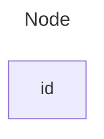

> **Note** The id is what is displayed in the box.

### A node with text

It is also possible to set text in the box that differs from the id. If this is done several times, it is the last text
found for the node that will be used. Also if you define edges for the node later on, you can omit text definitions. The
one previously defined will be used when rendering the box.

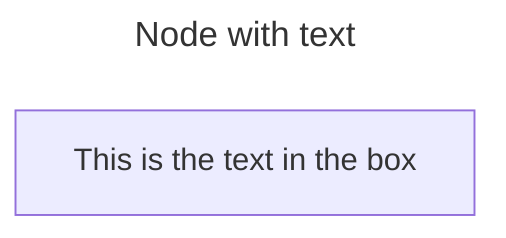

## Graph

This statement declares the direction of the Flowchart.

This declares the flowchart is oriented from top to bottom (`TD` or `TB`).

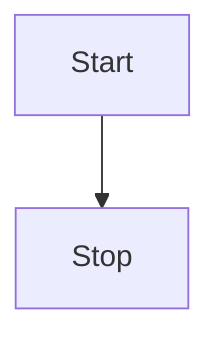

This declares the flowchart is oriented from left to right (`LR`).

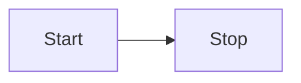

## Flowchart Orientation

Possible FlowChart orientations are:

- TB - top to bottom
- TD - top-down/ same as top to bottom
- BT - bottom to top
- RL - right to left
- LR - left to right

## Node shapes

### A node with round edges

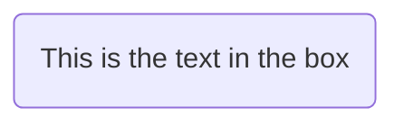

### A stadium-shaped node

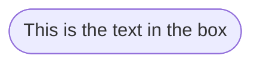

### A node in a subroutine shape

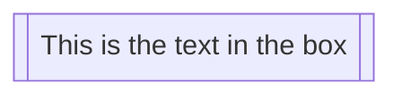

### A node in a cylindrical shape

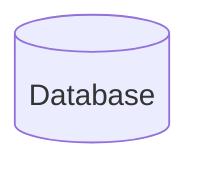

### A node in the form of a circle

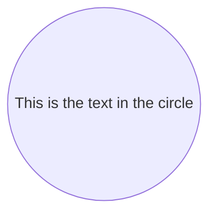

### A node in an asymmetric shape

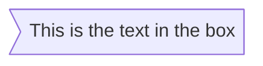

Currently only the shape above is possible and not its mirror. _This might change with future releases._

### A node (rhombus)

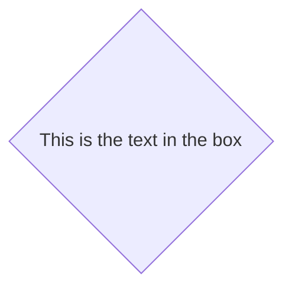

### A hexagon node

Code:

```mmd
flowchart LR
    id1{{This is the text in the box}}
```

Render:

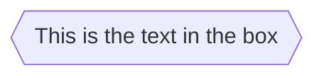

### Parallelogram

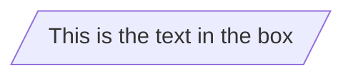

### Parallelogram alt

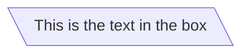

### Trapezoid

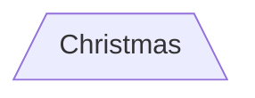

### Trapezoid alt

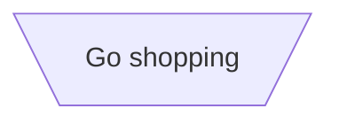

### Double circle

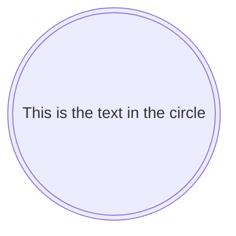

## Links between nodes

Nodes can be connected with links/edges. It is possible to have different types of links or attach a text string to a link.

### A link with arrow head

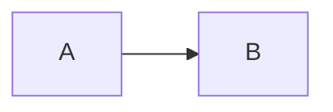

### An open link

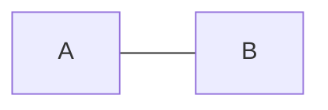

### Text on links

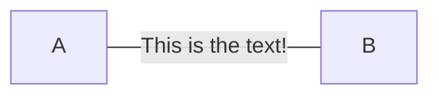

or

```mermaid-example
flowchart LR
    A---|This is the text|B
```

### A link with arrow head and text

```mermaid-example
flowchart LR
    A-->|text|B
```

or

```mermaid-example
flowchart LR
    A-- text -->B
```

### Dotted link

```mermaid-example
flowchart LR
   A-.->B;
```

### Dotted link with text

```mermaid-example
flowchart LR
   A-. text .-> B
```

### Thick link

```mermaid-example
flowchart LR
   A ==> B
```

### Thick link with text

```mermaid-example
flowchart LR
   A == text ==> B
```

### Chaining of links

It is possible declare many links in the same line as per below:

```mermaid-example
flowchart LR
   A -- text --> B -- text2 --> C
```

It is also possible to declare multiple nodes links in the same line as per below:

```mermaid-example
flowchart LR
   a --> b & c--> d
```

You can then describe dependencies in a very expressive way. Like the one-liner below:

```mermaid-example
flowchart TB
    A & B--> C & D
```

If you describe the same diagram using the the basic syntax, it will take four lines. A
word of warning, one could go overboard with this making the flowchart harder to read in
markdown form. The Swedish word `lagom` comes to mind. It means, not too much and not too little.
This goes for expressive syntaxes as well.

```mmd
flowchart TB
    A --> C
    A --> D
    B --> C
    B --> D
```

### New arrow types

There are new types of arrows supported as per below:

```mermaid-example
flowchart LR
    A --o B
    B --x C
```

### Multi directional arrows

There is the possibility to use multidirectional arrows.

```mermaid-example
flowchart LR
    A o--o B
    B <--> C
    C x--x D
```

### Minimum length of a link

Each node in the flowchart is ultimately assigned to a rank in the rendered
graph, i.e. to a vertical or horizontal level (depending on the flowchart
orientation), based on the nodes to which it is linked. By default, links
can span any number of ranks, but you can ask for any link to be longer
than the others by adding extra dashes in the link definition.

In the following example, two extra dashes are added in the link from node _B_
to node _E_, so that it spans two more ranks than regular links:

```mermaid-example
flowchart TD
    A[Start] --> B{Is it?}
    B -->|Yes| C[OK]
    C --> D[Rethink]
    D --> B
    B ---->|No| E[End]
```

> **Note** Links may still be made longer than the requested number of ranks
> by the rendering engine to accommodate other requests.

When the link label is written in the middle of the link, the extra dashes must
be added on the right side of the link. The following example is equivalent to
the previous one:

```mermaid-example
flowchart TD
    A[Start] --> B{Is it?}
    B -- Yes --> C[OK]
    C --> D[Rethink]
    D --> B
    B -- No ----> E[End]
```

For dotted or thick links, the characters to add are equals signs or dots,
as summed up in the following table:

| Length            |   1    |    2    |    3     |
| ----------------- | :----: | :-----: | :------: |
| Normal            | `---`  | `----`  | `-----`  |
| Normal with arrow | `-->`  | `--->`  | `---->`  |
| Thick             | `===`  | `====`  | `=====`  |
| Thick with arrow  | `==>`  | `===>`  | `====>`  |
| Dotted            | `-.-`  | `-..-`  | `-...-`  |
| Dotted with arrow | `-.->` | `-..->` | `-...->` |

## Special characters that break syntax

It is possible to put text within quotes in order to render more troublesome characters. As in the example below:

```mermaid-example
flowchart LR
    id1["This is the (text) in the box"]
```

### Entity codes to escape characters

It is possible to escape characters using the syntax exemplified here.

```mermaid-example
    flowchart LR
        A["A double quote:#quot;"] -->B["A dec char:#9829;"]
```

Numbers given are base 10, so `#` can be encoded as `#35;`. It is also supported to use HTML character names.

## Subgraphs

```
subgraph title
    graph definition
end
```

An example below:

```mermaid-example
flowchart TB
    c1-->a2
    subgraph one
    a1-->a2
    end
    subgraph two
    b1-->b2
    end
    subgraph three
    c1-->c2
    end
```

You can also set an explicit id for the subgraph.

```mermaid-example
flowchart TB
    c1-->a2
    subgraph ide1 [one]
    a1-->a2
    end
```

## flowcharts

With the graphtype flowchart it is also possible to set edges to and from subgraphs as in the flowchart below.

```mermaid-example
flowchart TB
    c1-->a2
    subgraph one
    a1-->a2
    end
    subgraph two
    b1-->b2
    end
    subgraph three
    c1-->c2
    end
    one --> two
    three --> two
    two --> c2
```

## Direction in subgraphs

With the graphtype flowcharts you can use the direction statement to set the direction which the subgraph will render like in this example.

```mermaid-example
flowchart LR
  subgraph TOP
    direction TB
    subgraph B1
        direction RL
        i1 -->f1
    end
    subgraph B2
        direction BT
        i2 -->f2
    end
  end
  A --> TOP --> B
  B1 --> B2
```

## Interaction

It is possible to bind a click event to a node, the click can lead to either a javascript callback or to a link which will be opened in a new browser tab. **Note**: This functionality is disabled when using `securityLevel='strict'` and enabled when using `securityLevel='loose'`.

```
click nodeId callback
click nodeId call callback()
```

- nodeId is the id of the node
- callback is the name of a javascript function defined on the page displaying the graph, the function will be called with the nodeId as parameter.

Examples of tooltip usage below:

```html
<script>
  const callback = function () {
    alert('A callback was triggered');
  };
</script>
```

The tooltip text is surrounded in double quotes. The styles of the tooltip are set by the class `.mermaidTooltip`.

```mermaid-example
flowchart LR
    A-->B
    B-->C
    C-->D
    click A callback "Tooltip for a callback"
    click B "https://www.github.com" "This is a tooltip for a link"
    click A call callback() "Tooltip for a callback"
    click B href "https://www.github.com" "This is a tooltip for a link"
```

> **Success** The tooltip functionality and the ability to link to urls are available from version 0.5.2.

?> Due to limitations with how Docsify handles JavaScript callback functions, an alternate working demo for the above code can be viewed at [this jsfiddle](https://jsfiddle.net/s37cjoau/3/).

Links are opened in the same browser tab/window by default. It is possible to change this by adding a link target to the click definition (`_self`, `_blank`, `_parent` and `_top` are supported):

```mermaid-example
flowchart LR
    A-->B
    B-->C
    C-->D
    D-->E
    click A "https://www.github.com" _blank
    click B "https://www.github.com" "Open this in a new tab" _blank
    click C href "https://www.github.com" _blank
    click D href "https://www.github.com" "Open this in a new tab" _blank
```

Beginner's tip—a full example using interactive links in a html context:

```html
<body>
  <pre class="mermaid">
    flowchart LR
        A-->B
        B-->C
        C-->D
        click A callback "Tooltip"
        click B "https://www.github.com" "This is a link"
        click C call callback() "Tooltip"
        click D href "https://www.github.com" "This is a link"
  </pre>

  <script>
    const callback = function () {
      alert('A callback was triggered');
    };
    const config = {
      startOnLoad: true,
      flowchart: { useMaxWidth: true, htmlLabels: true, curve: 'cardinal' },
      securityLevel: 'loose',
    };
    mermaid.initialize(config);
  </script>
</body>
```

### Comments

Comments can be entered within a flow diagram, which will be ignored by the parser. Comments need to be on their own line, and must be prefaced with `%%` (double percent signs). Any text after the start of the comment to the next newline will be treated as a comment, including any flow syntax

```mmd
flowchart LR
%% this is a comment A -- text --> B{node}
   A -- text --> B -- text2 --> C
```

## Styling and classes

### Styling links

It is possible to style links. For instance, you might want to style a link that is going backwards in the flow. As links
have no ids in the same way as nodes, some other way of deciding what style the links should be attached to is required.
Instead of ids, the order number of when the link was defined in the graph is used, or use default to apply to all links.
In the example below the style defined in the linkStyle statement will belong to the fourth link in the graph:

```
linkStyle 3 stroke:#ff3,stroke-width:4px,color:red;
```

### Styling line curves

It is possible to style the type of curve used for lines between items, if the default method does not meet your needs.
Available curve styles include `basis`, `bump`, `linear`, `monotoneX`, `monotoneY`, `natural`, `step`, `stepAfter`,
and `stepBefore`.

In this example, a left-to-right graph uses the `stepBefore` curve style:

```
%%{ init: { 'flowchart': { 'curve': 'stepBefore' } } }%%
graph LR
```

For a full list of available curves, including an explanation of custom curves, refer to
the [Shapes](https://github.com/d3/d3-shape/blob/main/README.md#curves) documentation in the
[d3-shape](https://github.com/d3/d3-shape/) project.

### Styling a node

It is possible to apply specific styles such as a thicker border or a different background color to a node.

```mermaid-example
flowchart LR
    id1(Start)-->id2(Stop)
    style id1 fill:#f9f,stroke:#333,stroke-width:4px
    style id2 fill:#bbf,stroke:#f66,stroke-width:2px,color:#fff,stroke-dasharray: 5 5
```

#### Classes

More convenient than defining the style every time is to define a class of styles and attach this class to the nodes that
should have a different look.

a class definition looks like the example below:

```
    classDef className fill:#f9f,stroke:#333,stroke-width:4px;
```

Attachment of a class to a node is done as per below:

```
    class nodeId1 className;
```

It is also possible to attach a class to a list of nodes in one statement:

```
    class nodeId1,nodeId2 className;
```

A shorter form of adding a class is to attach the classname to the node using the `:::`operator as per below:

```mermaid-example
flowchart LR
    A:::someclass --> B
    classDef someclass fill:#f96
```

### Css classes

It is also possible to predefine classes in css styles that can be applied from the graph definition as in the example
below:

**Example style**

```html
<style>
  .cssClass > rect {
    fill: #ff0000;
    stroke: #ffff00;
    stroke-width: 4px;
  }
</style>
```

**Example definition**

```mermaid-example
flowchart LR
    A-->B[AAA<span>BBB</span>]
    B-->D
    class A cssClass
```

### Default class

If a class is named default it will be assigned to all classes without specific class definitions.

```
    classDef default fill:#f9f,stroke:#333,stroke-width:4px;
```

## Basic support for fontawesome

It is possible to add icons from fontawesome.

The icons are accessed via the syntax fa:#icon class name#.

```mermaid-example
flowchart TD
    B["fab:fa-twitter for peace"]
    B-->C[fa:fa-ban forbidden]
    B-->D(fa:fa-spinner)
    B-->E(A fa:fa-camera-retro perhaps?)
```

?> Mermaid is now only compatible with Font Awesome versions 4 and 5. Check that you are using the correct version of Font Awesome.

## Graph declarations with spaces between vertices and link and without semicolon

- In graph declarations, the statements also can now end without a semicolon. After release 0.2.16, ending a graph statement with semicolon is just optional. So the below graph declaration is also valid along with the old declarations of the graph.

- A single space is allowed between vertices and the link. However there should not be any space between a vertex and its text and a link and its text. The old syntax of graph declaration will also work and hence this new feature is optional and is introduced to improve readability.

Below is the new declaration of the graph edges which is also valid along with the old declaration of the graph edges.

```mermaid-example
flowchart LR
    A[Hard edge] -->|Link text| B(Round edge)
    B --> C{Decision}
    C -->|One| D[Result one]
    C -->|Two| E[Result two]
```

## Configuration...

It is possible to adjust the width of the rendered flowchart.

This is done by defining **mermaid.flowchartConfig** or by the CLI to use a JSON file with the configuration. How to use the CLI is described in the mermaidCLI page.
mermaid.flowchartConfig can be set to a JSON string with config parameters or the corresponding object.

```javascript
mermaid.flowchartConfig = {
    width: 100%
}
```

---
---
---

# Sequence diagrams

> A Sequence diagram is an interaction diagram that shows how processes operate with one another and in what order.

Mermaid can render sequence diagrams.

```mermaid-example
sequenceDiagram
    Alice->>John: Hello John, how are you?
    John-->>Alice: Great!
    Alice-)John: See you later!
```

```note
A note on nodes, the word "end" could potentially break the diagram, due to the way that the mermaid language is scripted.

If unavoidable, one must use parentheses(), quotation marks "", or brackets {},[], to enclose the word "end". i.e : (end), [end], {end}.
```

## Syntax

### Participants

The participants can be defined implicitly as in the first example on this page. The participants or actors are
rendered in order of appearance in the diagram source text. Sometimes you might want to show the participants in a
different order than how they appear in the first message. It is possible to specify the actor's order of
appearance by doing the following:

```mermaid-example
sequenceDiagram
    participant Alice
    participant Bob
    Alice->>Bob: Hi Bob
    Bob->>Alice: Hi Alice
```

### Actors

If you specifically want to use the actor symbol instead of a rectangle with text you can do so by using actor statements as per below.

```mermaid-example
sequenceDiagram
    actor Alice
    actor Bob
    Alice->>Bob: Hi Bob
    Bob->>Alice: Hi Alice
```

### Aliases

The actor can have a convenient identifier and a descriptive label.

```mermaid-example
sequenceDiagram
    participant A as Alice
    participant J as John
    A->>J: Hello John, how are you?
    J->>A: Great!
```

## Messages

Messages can be of two displayed either solid or with a dotted line.

```
[Actor][Arrow][Actor]:Message text
```

There are six types of arrows currently supported:

| Type | Description                                      |
| ---- | ------------------------------------------------ |
| ->   | Solid line without arrow                         |
| -->  | Dotted line without arrow                        |
| ->>  | Solid line with arrowhead                        |
| -->> | Dotted line with arrowhead                       |
| -x   | Solid line with a cross at the end               |
| --x  | Dotted line with a cross at the end.             |
| -)   | Solid line with an open arrow at the end (async) |
| --)  | Dotted line with a open arrow at the end (async) |

## Activations

It is possible to activate and deactivate an actor. (de)activation can be dedicated declarations:

```mermaid-example
sequenceDiagram
    Alice->>John: Hello John, how are you?
    activate John
    John-->>Alice: Great!
    deactivate John
```

There is also a shortcut notation by appending `+`/`-` suffix to the message arrow:

```mermaid-example
sequenceDiagram
    Alice->>+John: Hello John, how are you?
    John-->>-Alice: Great!
```

Activations can be stacked for same actor:

```mermaid-example
sequenceDiagram
    Alice->>+John: Hello John, how are you?
    Alice->>+John: John, can you hear me?
    John-->>-Alice: Hi Alice, I can hear you!
    John-->>-Alice: I feel great!
```

## Notes

It is possible to add notes to a sequence diagram. This is done by the notation
Note [ right of | left of | over ] [Actor]: Text in note content

See the example below:

```mermaid-example
sequenceDiagram
    participant John
    Note right of John: Text in note
```

It is also possible to create notes spanning two participants:

```mermaid-example
sequenceDiagram
    Alice->John: Hello John, how are you?
    Note over Alice,John: A typical interaction
```

## Loops

It is possible to express loops in a sequence diagram. This is done by the notation

```
loop Loop text
... statements ...
end
```

See the example below:

```mermaid-example
sequenceDiagram
    Alice->John: Hello John, how are you?
    loop Every minute
        John-->Alice: Great!
    end
```

## Alt

It is possible to express alternative paths in a sequence diagram. This is done by the notation

```
alt Describing text
... statements ...
else
... statements ...
end
```

or if there is sequence that is optional (if without else).

```
opt Describing text
... statements ...
end
```

See the example below:

```mermaid-example
sequenceDiagram
    Alice->>Bob: Hello Bob, how are you?
    alt is sick
        Bob->>Alice: Not so good :(
    else is well
        Bob->>Alice: Feeling fresh like a daisy
    end
    opt Extra response
        Bob->>Alice: Thanks for asking
    end
```

## Parallel

It is possible to show actions that are happening in parallel.

This is done by the notation

```
par [Action 1]
... statements ...
and [Action 2]
... statements ...
and [Action N]
... statements ...
end
```

See the example below:

```mermaid-example
sequenceDiagram
    par Alice to Bob
        Alice->>Bob: Hello guys!
    and Alice to John
        Alice->>John: Hello guys!
    end
    Bob-->>Alice: Hi Alice!
    John-->>Alice: Hi Alice!
```

It is also possible to nest parallel blocks.

```mermaid-example
sequenceDiagram
    par Alice to Bob
        Alice->>Bob: Go help John
    and Alice to John
        Alice->>John: I want this done today
        par John to Charlie
            John->>Charlie: Can we do this today?
        and John to Diana
            John->>Diana: Can you help us today?
        end
    end
```

## Critical Region

It is possible to show actions that must happen automatically with conditional handling of circumstances.

This is done by the notation

```
critical [Action that must be performed]
... statements ...
option [Circumstance A]
... statements ...
option [Circumstance B]
... statements ...
end
```

See the example below:

```mermaid-example
sequenceDiagram
    critical Establish a connection to the DB
        Service-->DB: connect
    option Network timeout
        Service-->Service: Log error
    option Credentials rejected
        Service-->Service: Log different error
    end
```

It is also possible to have no options at all

```mermaid-example
sequenceDiagram
    critical Establish a connection to the DB
        Service-->DB: connect
    end
```

This critical block can also be nested, equivalently to the `par` statement as seen above.

## Break

It is possible to indicate a stop of the sequence within the flow (usually used to model exceptions).

This is done by the notation

```
break [something happened]
... statements ...
end
```

See the example below:

```mermaid-example
sequenceDiagram
    Consumer-->API: Book something
    API-->BookingService: Start booking process
    break when the booking process fails
        API-->Consumer: show failure
    end
    API-->BillingService: Start billing process
```

## Background Highlighting

It is possible to highlight flows by providing colored background rects. This is done by the notation

The colors are defined using rgb and rgba syntax.

```
rect rgb(0, 255, 0)
... content ...
end
```

```
rect rgba(0, 0, 255, .1)
... content ...
end
```

See the examples below:

```mermaid-example
sequenceDiagram
    participant Alice
    participant John

    rect rgb(191, 223, 255)
    note right of Alice: Alice calls John.
    Alice->>+John: Hello John, how are you?
    rect rgb(200, 150, 255)
    Alice->>+John: John, can you hear me?
    John-->>-Alice: Hi Alice, I can hear you!
    end
    John-->>-Alice: I feel great!
    end
    Alice ->>+ John: Did you want to go to the game tonight?
    John -->>- Alice: Yeah! See you there.

```

## Comments

Comments can be entered within a sequence diagram, which will be ignored by the parser. Comments need to be on their own line, and must be prefaced with `%%` (double percent signs). Any text after the start of the comment to the next newline will be treated as a comment, including any diagram syntax

```mmd
sequenceDiagram
    Alice->>John: Hello John, how are you?
    %% this is a comment
    John-->>Alice: Great!
```

## Entity codes to escape characters

It is possible to escape characters using the syntax exemplified here.

```mermaid-example
sequenceDiagram
    A->>B: I #9829; you!
    B->>A: I #9829; you #infin; times more!
```

Numbers given are base 10, so `#` can be encoded as `#35;`. It is also supported to use HTML character names.

Because semicolons can be used instead of line breaks to define the markup, you need to use `#59;` to include a semicolon in message text.

## sequenceNumbers

It is possible to get a sequence number attached to each arrow in a sequence diagram. This can be configured when adding mermaid to the website as shown below:

```html
<script>
  mermaid.initialize({ sequence: { showSequenceNumbers: true } });
</script>
```

It can also be be turned on via the diagram code as in the diagram:

```mermaid-example
sequenceDiagram
    autonumber
    Alice->>John: Hello John, how are you?
    loop Healthcheck
        John->>John: Fight against hypochondria
    end
    Note right of John: Rational thoughts!
    John-->>Alice: Great!
    John->>Bob: How about you?
    Bob-->>John: Jolly good!
```

## Actor Menus

Actors can have popup-menus containing individualized links to external pages. For example, if an actor represented a web service, useful links might include a link to the service health dashboard, repo containing the code for the service, or a wiki page describing the service.

This can be configured by adding one or more link lines with the format:

```
link <actor>: <link-label> @ <link-url>
```

```mmd
sequenceDiagram
    participant Alice
    participant John
    link Alice: Dashboard @ https://dashboard.contoso.com/alice
    link Alice: Wiki @ https://wiki.contoso.com/alice
    link John: Dashboard @ https://dashboard.contoso.com/john
    link John: Wiki @ https://wiki.contoso.com/john
    Alice->>John: Hello John, how are you?
    John-->>Alice: Great!
    Alice-)John: See you later!
```

#### Advanced Menu Syntax

There is an advanced syntax that relies on JSON formatting. If you are comfortable with JSON format, then this exists as well.

This can be configured by adding the links lines with the format:

```
links <actor>: <json-formatted link-name link-url pairs>
```

An example is below:

```mermaid-example
sequenceDiagram
    participant Alice
    participant John
    links Alice: {"Dashboard": "https://dashboard.contoso.com/alice", "Wiki": "https://wiki.contoso.com/alice"}
    links John: {"Dashboard": "https://dashboard.contoso.com/john", "Wiki": "https://wiki.contoso.com/john"}
    Alice->>John: Hello John, how are you?
    John-->>Alice: Great!
    Alice-)John: See you later!
```

## Styling

Styling of a sequence diagram is done by defining a number of css classes. During rendering these classes are extracted from the file located at src/themes/sequence.scss

### Classes used

| Class        | Description                                                 |
| ------------ | ----------------------------------------------------------- |
| actor        | Style for the actor box at the top of the diagram.          |
| text.actor   | Styles for text in the actor box at the top of the diagram. |
| actor-line   | The vertical line for an actor.                             |
| messageLine0 | Styles for the solid message line.                          |
| messageLine1 | Styles for the dotted message line.                         |
| messageText  | Defines styles for the text on the message arrows.          |
| labelBox     | Defines styles label to left in a loop.                     |
| labelText    | Styles for the text in label for loops.                     |
| loopText     | Styles for the text in the loop box.                        |
| loopLine     | Defines styles for the lines in the loop box.               |
| note         | Styles for the note box.                                    |
| noteText     | Styles for the text on in the note boxes.                   |

### Sample stylesheet

```css
body {
  background: white;
}

.actor {
  stroke: #ccccff;
  fill: #ececff;
}
text.actor {
  fill: black;
  stroke: none;
  font-family: Helvetica;
}

.actor-line {
  stroke: grey;
}

.messageLine0 {
  stroke-width: 1.5;
  stroke-dasharray: '2 2';
  marker-end: 'url(#arrowhead)';
  stroke: black;
}

.messageLine1 {
  stroke-width: 1.5;
  stroke-dasharray: '2 2';
  stroke: black;
}

#arrowhead {
  fill: black;
}

.messageText {
  fill: black;
  stroke: none;
  font-family: 'trebuchet ms', verdana, arial;
  font-size: 14px;
}

.labelBox {
  stroke: #ccccff;
  fill: #ececff;
}

.labelText {
  fill: black;
  stroke: none;
  font-family: 'trebuchet ms', verdana, arial;
}

.loopText {
  fill: black;
  stroke: none;
  font-family: 'trebuchet ms', verdana, arial;
}

.loopLine {
  stroke-width: 2;
  stroke-dasharray: '2 2';
  marker-end: 'url(#arrowhead)';
  stroke: #ccccff;
}

.note {
  stroke: #decc93;
  fill: #fff5ad;
}

.noteText {
  fill: black;
  stroke: none;
  font-family: 'trebuchet ms', verdana, arial;
  font-size: 14px;
}
```

## Configuration

It is possible to adjust the margins for rendering the sequence diagram.

This is done by defining `mermaid.sequenceConfig` or by the CLI to use a json file with the configuration.
How to use the CLI is described in the [mermaidCLI](../config/mermaidCLI.md) page.
`mermaid.sequenceConfig` can be set to a JSON string with config parameters or the corresponding object.

```javascript
mermaid.sequenceConfig = {
  diagramMarginX: 50,
  diagramMarginY: 10,
  boxTextMargin: 5,
  noteMargin: 10,
  messageMargin: 35,
  mirrorActors: true,
};
```

### Possible configuration parameters:

| Parameter         | Description                                                                                                                                | Default value                  |
| ----------------- | ------------------------------------------------------------------------------------------------------------------------------------------ | ------------------------------ |
| mirrorActors      | Turns on/off the rendering of actors below the diagram as well as above it                                                                 | false                          |
| bottomMarginAdj   | Adjusts how far down the graph ended. Wide borders styles with css could generate unwanted clipping which is why this config param exists. | 1                              |
| actorFontSize     | Sets the font size for the actor's description                                                                                             | 14                             |
| actorFontFamily   | Sets the font family for the actor's description                                                                                           | "Open Sans", sans-serif        |
| actorFontWeight   | Sets the font weight for the actor's description                                                                                           | "Open Sans", sans-serif        |
| noteFontSize      | Sets the font size for actor-attached notes                                                                                                | 14                             |
| noteFontFamily    | Sets the font family for actor-attached notes                                                                                              | "trebuchet ms", verdana, arial |
| noteFontWeight    | Sets the font weight for actor-attached notes                                                                                              | "trebuchet ms", verdana, arial |
| noteAlign         | Sets the text alignment for text in actor-attached notes                                                                                   | center                         |
| messageFontSize   | Sets the font size for actor<->actor messages                                                                                              | 16                             |
| messageFontFamily | Sets the font family for actor<->actor messages                                                                                            | "trebuchet ms", verdana, arial |
| messageFontWeight | Sets the font weight for actor<->actor messages                                                                                            | "trebuchet ms", verdana, arial |


---
---
---

# Class diagrams

> "In software engineering, a class diagram in the Unified Modeling Language (UML) is a type of static structure diagram that describes the structure of a system by showing the system's classes, their attributes, operations (or methods), and the relationships among objects."
> Wikipedia

The class diagram is the main building block of object-oriented modeling. It is used for general conceptual modeling of the structure of the application, and for detailed modeling to translate the models into programming code. Class diagrams can also be used for data modeling. The classes in a class diagram represent both the main elements, interactions in the application, and the classes to be programmed.

Mermaid can render class diagrams.

```mermaid-example
---
title: Animal example
---
classDiagram
    note "From Duck till Zebra"
    Animal <|-- Duck
    note for Duck "can fly\ncan swim\ncan dive\ncan help in debugging"
    Animal <|-- Fish
    Animal <|-- Zebra
    Animal : +int age
    Animal : +String gender
    Animal: +isMammal()
    Animal: +mate()
    class Duck{
        +String beakColor
        +swim()
        +quack()
    }
    class Fish{
        -int sizeInFeet
        -canEat()
    }
    class Zebra{
        +bool is_wild
        +run()
    }
```

## Syntax

### Class

UML provides mechanisms to represent class members, such as attributes and methods, and additional information about them.
A single instance of a class in the diagram contains three compartments:

- The top compartment contains the name of the class. It is printed in bold and centered, and the first letter is capitalized. It may also contain optional annotation text describing the nature of the class.
- The middle compartment contains the attributes of the class. They are left-aligned and the first letter is lowercase.
- The bottom compartment contains the operations the class can execute. They are also left-aligned and the first letter is lowercase.

```mermaid-example
---
title: Bank example
---
classDiagram
    class BankAccount
    BankAccount : +String owner
    BankAccount : +Bigdecimal balance
    BankAccount : +deposit(amount)
    BankAccount : +withdrawal(amount)

```

## Define a class

There are two ways to define a class:

- Explicitly using keyword **class** like `class Animal` which would define the Animal class.
- Via a **relationship** which defines two classes at a time along with their relationship. For instance, `Vehicle <|-- Car`.

```mermaid-example
classDiagram
    class Animal
    Vehicle <|-- Car
```

Naming convention: a class name should be composed only of alphanumeric characters (including unicode), and underscores.

## Defining Members of a class

UML provides mechanisms to represent class members such as attributes and methods, as well as additional information about them.

Mermaid distinguishes between attributes and functions/methods based on if the **parenthesis** `()` are present or not. The ones with `()` are treated as functions/methods, and all others as attributes.

There are two ways to define the members of a class, and regardless of whichever syntax is used to define the members, the output will still be same. The two different ways are :

- Associate a member of a class using **:** (colon) followed by member name, useful to define one member at a time. For example:

```mermaid-example
classDiagram
class BankAccount
BankAccount : +String owner
BankAccount : +BigDecimal balance
BankAccount : +deposit(amount)
BankAccount : +withdrawal(amount)
```

- Associate members of a class using **{}** brackets, where members are grouped within curly brackets. Suitable for defining multiple members at once. For example:

```mermaid-example
classDiagram
class BankAccount{
    +String owner
    +BigDecimal balance
    +deposit(amount)
    +withdrawal(amount)
}
```

#### Return Type

Optionally you can end a method/function definition with the data type that will be returned (note: there must be a space between the final `)` and the return type). An example:

```mermaid-example
classDiagram
class BankAccount{
    +String owner
    +BigDecimal balance
    +deposit(amount) bool
    +withdrawal(amount) int
}
```

#### Generic Types

Members can be defined using generic types, such as `List<int>`, for fields, parameters, and return types by enclosing the type within `~` (**tilde**). Note: **nested** type declarations such as `List<List<int>>` are not currently supported.

Generics can be represented as part of a class definition and also in the parameters or the return value of a method/function:

```mermaid-example
classDiagram
class Square~Shape~{
    int id
    List~int~ position
    setPoints(List~int~ points)
    getPoints() List~int~
}

Square : -List~string~ messages
Square : +setMessages(List~string~ messages)
Square : +getMessages() List~string~
```

#### Return Type

Optionally you can end the method/function definition with the data type that will be returned.

#### Visibility

To describe the visibility (or encapsulation) of an attribute or method/function that is a part of a class (i.e. a class member), optional notation may be placed before that members' name:

- `+` Public
- `-` Private
- `#` Protected
- `~` Package/Internal

> _note_ you can also include additional _classifiers_ to a method definition by adding the following notation to the _end_ of the method, i.e.: after the `()`:
>
> - `*` Abstract e.g.: `someAbstractMethod()*`
> - `$` Static e.g.: `someStaticMethod()$`

> _note_ you can also include additional _classifiers_ to a field definition by adding the following notation to the end of its name:
>
> - `$` Static e.g.: `String someField$`

## Defining Relationship

A relationship is a general term covering the specific types of logical connections found on class and object diagrams.

```
[classA][Arrow][ClassB]
```

There are eight different types of relations defined for classes under UML which are currently supported:

| Type    | Description   |
| ------- | ------------- |
| `<\|--` | Inheritance   |
| `\*--`  | Composition   |
| `o--`   | Aggregation   |
| `-->`   | Association   |
| `--`    | Link (Solid)  |
| `..>`   | Dependency    |
| `..\|>` | Realization   |
| `..`    | Link (Dashed) |

```mermaid-example
classDiagram
classA <|-- classB
classC *-- classD
classE o-- classF
classG <-- classH
classI -- classJ
classK <.. classL
classM <|.. classN
classO .. classP

```

We can use the labels to describe the nature of the relation between two classes. Also, arrowheads can be used in the opposite direction as well:

```mermaid-example
classDiagram
classA --|> classB : Inheritance
classC --* classD : Composition
classE --o classF : Aggregation
classG --> classH : Association
classI -- classJ : Link(Solid)
classK ..> classL : Dependency
classM ..|> classN : Realization
classO .. classP : Link(Dashed)

```

### Labels on Relations

It is possible to add label text to a relation:

```
[classA][Arrow][ClassB]:LabelText
```

```mermaid-example
classDiagram
classA <|-- classB : implements
classC *-- classD : composition
classE o-- classF : aggregation
```

### Two-way relations

Relations can logically represent an N:M association:

```mmd
classDiagram
    Animal <|--|> Zebra
```

Here is the syntax:

```
[Relation Type][Link][Relation Type]
```

Where `Relation Type` can be one of:

| Type  | Description |
| ----- | ----------- |
| `<\|` | Inheritance |
| `\*`  | Composition |
| `o`   | Aggregation |
| `>`   | Association |
| `<`   | Association |
| `\|>` | Realization |

And `Link` can be one of:

| Type | Description |
| ---- | ----------- |
| --   | Solid       |
| ..   | Dashed      |

## Cardinality / Multiplicity on relations

Multiplicity or cardinality in class diagrams indicates the number of instances of one class that can be linked to an instance of the other class. For example, each company will have one or more employees (not zero), and each employee currently works for zero or one companies.

Multiplicity notations are placed near the end of an association.

The different cardinality options are :

- `1` Only 1
- `0..1` Zero or One
- `1..*` One or more
- `*` Many
- `n` n {where n>1}
- `0..n` zero to n {where n>1}
- `1..n` one to n {where n>1}

Cardinality can be easily defined by placing the text option within quotes `"` before or after a given arrow. For example:

```
[classA] "cardinality1" [Arrow] "cardinality2" [ClassB]:LabelText
```

```mermaid-example
classDiagram
    Customer "1" --> "*" Ticket
    Student "1" --> "1..*" Course
    Galaxy --> "many" Star : Contains
```

## Annotations on classes

It is possible to annotate classes with markers to provide additional metadata about the class. This can give a clearer indication about its nature. Some common annotations include:

- `<<Interface>>` To represent an Interface class
- `<<Abstract>>` To represent an abstract class
- `<<Service>>` To represent a service class
- `<<Enumeration>>` To represent an enum

Annotations are defined within the opening `<<` and closing `>>`. There are two ways to add an annotation to a class, and either way the output will be same:

- In a **_separate line_** after a class is defined:

```mermaid-example
classDiagram
class Shape
<<interface>> Shape
Shape : noOfVertices
Shape : draw()
```

- In a **_nested structure_** along with the class definition:

```mermaid-example
classDiagram
class Shape{
    <<interface>>
    noOfVertices
    draw()
}
class Color{
    <<enumeration>>
    RED
    BLUE
    GREEN
    WHITE
    BLACK
}

```

## Comments

Comments can be entered within a class diagram, which will be ignored by the parser. Comments need to be on their own line, and must be prefaced with `%%` (double percent signs). Any text until the next newline will be treated as a comment, including any class diagram syntax.

```mmd
classDiagram
%% This whole line is a comment classDiagram class Shape <<interface>>
class Shape{
    <<interface>>
    noOfVertices
    draw()
}
```

## Setting the direction of the diagram

With class diagrams you can use the direction statement to set the direction in which the diagram will render:

```mermaid-example
classDiagram
  direction RL
  class Student {
    -idCard : IdCard
  }
  class IdCard{
    -id : int
    -name : string
  }
  class Bike{
    -id : int
    -name : string
  }
  Student "1" --o "1" IdCard : carries
  Student "1" --o "1" Bike : rides
```

## Interaction

It is possible to bind a click event to a node. The click can lead to either a javascript callback or to a link which will be opened in a new browser tab. **Note**: This functionality is disabled when using `securityLevel='strict'` and enabled when using `securityLevel='loose'`.

You would define these actions on a separate line after all classes have been declared.

```
action className "reference" "tooltip"
click className call callback() "tooltip"
click className href "url" "tooltip"
```

- _action_ is either `link` or `callback`, depending on which type of interaction you want to have called
- _className_ is the id of the node that the action will be associated with
- _reference_ is either the url link, or the function name for callback.
- (_optional_) tooltip is a string to be displayed when hovering over element (note: The styles of the tooltip are set by the class .mermaidTooltip.)
- note: callback function will be called with the nodeId as parameter.

## Notes

It is possible to add notes on diagram using `note "line1\nline2"` or note for class using `note for class "line1\nline2"`

### Examples

_URL Link:_

```mmd
classDiagram
class Shape
link Shape "https://www.github.com" "This is a tooltip for a link"
class Shape2
click Shape2 href "https://www.github.com" "This is a tooltip for a link"
```

_Callback:_

```mmd
classDiagram
class Shape
callback Shape "callbackFunction" "This is a tooltip for a callback"
class Shape2
click Shape2 call callbackFunction() "This is a tooltip for a callback"
```

```html
<script>
  const callbackFunction = function () {
    alert('A callback was triggered');
  };
</script>
```

```mermaid
classDiagram
    class Class01
    class Class02
    callback Class01 "callbackFunction" "Callback tooltip"
    link Class02 "https://www.github.com" "This is a link"
    class Class03
    class Class04
    click Class03 call callbackFunction() "Callback tooltip"
    click Class04 href "https://www.github.com" "This is a link"
```

> **Success** The tooltip functionality and the ability to link to urls are available from version 0.5.2.

Beginner's tip—a full example using interactive links in an HTML page:

```html
<body>
  <pre class="mermaid">
    classDiagram
    Animal <|-- Duck
    Animal <|-- Fish
    Animal <|-- Zebra
    Animal : +int age
    Animal : +String gender
    Animal: +isMammal()
    Animal: +mate()
    class Duck{
      +String beakColor
      +swim()
      +quack()
      }
    class Fish{
      -int sizeInFeet
      -canEat()
      }
    class Zebra{
      +bool is_wild
      +run()
      }

      callback Duck callback "Tooltip"
      link Zebra "https://www.github.com" "This is a link"
  </pre>

  <script>
    const callback = function () {
      alert('A callback was triggered');
    };
    const config = {
      startOnLoad: true,
      securityLevel: 'loose',
    };
    mermaid.initialize(config);
  </script>
</body>
```

## Styling

### Styling a node

It is possible to apply specific styles such as a thicker border or a different background color to individual nodes. This is done by predefining classes in css styles that can be applied from the graph definition:

```html
<style>
  .cssClass > rect {
    fill: #ff0000;
    stroke: #ffff00;
    stroke-width: 4px;
  }
</style>
```

Then attaching that class to a specific node:

```
    cssClass "nodeId1" cssClass;
```

It is also possible to attach a class to a list of nodes in one statement:

```
    cssClass "nodeId1,nodeId2" cssClass;
```

A shorter form of adding a class is to attach the classname to the node using the `:::` operator:

```mermaid-example
classDiagram
    class Animal:::cssClass
```

Or:

```mermaid-example
classDiagram
    class Animal:::cssClass {
        -int sizeInFeet
        -canEat()
    }
```

?> cssClasses cannot be added using this shorthand method at the same time as a relation statement.

?> Due to limitations with existing markup for class diagrams, it is not currently possible to define css classes within the diagram itself. **_Coming soon!_**

### Default Styles

The main styling of the class diagram is done with a preset number of css classes. During rendering these classes are extracted from the file located at src/themes/class.scss. The classes used here are described below:

| Class              | Description                                                       |
| ------------------ | ----------------------------------------------------------------- |
| g.classGroup text  | Styles for general class text                                     |
| classGroup .title  | Styles for general class title                                    |
| g.classGroup rect  | Styles for class diagram rectangle                                |
| g.classGroup line  | Styles for class diagram line                                     |
| .classLabel .box   | Styles for class label box                                        |
| .classLabel .label | Styles for class label text                                       |
| composition        | Styles for composition arrow head and arrow line                  |
| aggregation        | Styles for aggregation arrow head and arrow line(dashed or solid) |
| dependency         | Styles for dependency arrow head and arrow line                   |

#### Sample stylesheet

```scss
body {
  background: white;
}

g.classGroup text {
  fill: $nodeBorder;
  stroke: none;
  font-family: 'trebuchet ms', verdana, arial;
  font-family: var(--mermaid-font-family);
  font-size: 10px;

  .title {
    font-weight: bolder;
  }
}

g.classGroup rect {
  fill: $nodeBkg;
  stroke: $nodeBorder;
}

g.classGroup line {
  stroke: $nodeBorder;
  stroke-width: 1;
}

.classLabel .box {
  stroke: none;
  stroke-width: 0;
  fill: $nodeBkg;
  opacity: 0.5;
}

.classLabel .label {
  fill: $nodeBorder;
  font-size: 10px;
}

.relation {
  stroke: $nodeBorder;
  stroke-width: 1;
  fill: none;
}

@mixin composition {
  fill: $nodeBorder;
  stroke: $nodeBorder;
  stroke-width: 1;
}

#compositionStart {
  @include composition;
}

#compositionEnd {
  @include composition;
}

@mixin aggregation {
  fill: $nodeBkg;
  stroke: $nodeBorder;
  stroke-width: 1;
}

#aggregationStart {
  @include aggregation;
}

#aggregationEnd {
  @include aggregation;
}

#dependencyStart {
  @include composition;
}

#dependencyEnd {
  @include composition;
}

#extensionStart {
  @include composition;
}

#extensionEnd {
  @include composition;
}
```

## Configuration

`Coming soon!`


---
---
---

# State diagrams

> "A state diagram is a type of diagram used in computer science and related fields to describe the behavior of systems.
> State diagrams require that the system described is composed of a finite number of states; sometimes, this is indeed the
> case, while at other times this is a reasonable abstraction." Wikipedia

Mermaid can render state diagrams. The syntax tries to be compliant with the syntax used in plantUml as this will make
it easier for users to share diagrams between mermaid and plantUml.

```mermaid-example
---
title: Simple sample
---
stateDiagram-v2
    [*] --> Still
    Still --> [*]

    Still --> Moving
    Moving --> Still
    Moving --> Crash
    Crash --> [*]
```

Older renderer:

```mermaid-example
stateDiagram
    [*] --> Still
    Still --> [*]

    Still --> Moving
    Moving --> Still
    Moving --> Crash
    Crash --> [*]
```

In state diagrams systems are described in terms of _states_ and how one _state_ can change to another _state_ via
a _transition._ The example diagram above shows three states: **Still**, **Moving** and **Crash**. You start in the
**Still** state. From **Still** you can change to the **Moving** state. From **Moving** you can change either back to the **Still** state or to
the **Crash** state. There is no transition from **Still** to **Crash**. (You can't crash if you're still.)

## States

A state can be declared in multiple ways. The simplest way is to define a state with just an id:

```mermaid-example
stateDiagram-v2
    stateId
```

Another way is by using the state keyword with a description as per below:

```mermaid-example
stateDiagram-v2
    state "This is a state description" as s2
```

Another way to define a state with a description is to define the state id followed by a colon and the description:

```mermaid-example
stateDiagram-v2
    s2 : This is a state description
```

## Transitions

Transitions are path/edges when one state passes into another. This is represented using text arrow, "\-\-\>".

When you define a transition between two states and the states are not already defined, the undefined states are defined
with the id from the transition. You can later add descriptions to states defined this way.

```mermaid-example
stateDiagram-v2
    s1 --> s2
```

It is possible to add text to a transition to describe what it represents:

```mermaid-example
stateDiagram-v2
    s1 --> s2: A transition
```

## Start and End

There are two special states indicating the start and stop of the diagram. These are written with the [\*] syntax and
the direction of the transition to it defines it either as a start or a stop state.

```mermaid-example
stateDiagram-v2
    [*] --> s1
    s1 --> [*]
```

## Composite states

In a real world use of state diagrams you often end up with diagrams that are multidimensional as one state can
have several internal states. These are called composite states in this terminology.

In order to define a composite state you need to use the state keyword followed by an id and the body of the composite
state between \{\}. See the example below:

```mermaid-example
stateDiagram-v2
    [*] --> First
    state First {
        [*] --> second
        second --> [*]
    }
```

You can do this in several layers:

```mermaid-example
stateDiagram-v2
    [*] --> First

    state First {
        [*] --> Second

        state Second {
            [*] --> second
            second --> Third

            state Third {
                [*] --> third
                third --> [*]
            }
        }
    }
```

You can also define transitions also between composite states:

```mermaid-example
stateDiagram-v2
    [*] --> First
    First --> Second
    First --> Third

    state First {
        [*] --> fir
        fir --> [*]
    }
    state Second {
        [*] --> sec
        sec --> [*]
    }
    state Third {
        [*] --> thi
        thi --> [*]
    }
```

_You can not define transitions between internal states belonging to different composite states_

## Choice

Sometimes you need to model a choice between two or more paths, you can do so using &lt;&lt;choice&gt;&gt;.

```mermaid-example
stateDiagram-v2
    state if_state <<choice>>
    [*] --> IsPositive
    IsPositive --> if_state
    if_state --> False: if n < 0
    if_state --> True : if n >= 0
```

## Forks

It is possible to specify a fork in the diagram using &lt;&lt;fork&gt;&gt; &lt;&lt;join&gt;&gt;.

```mermaid-example
   stateDiagram-v2
    state fork_state <<fork>>
      [*] --> fork_state
      fork_state --> State2
      fork_state --> State3

      state join_state <<join>>
      State2 --> join_state
      State3 --> join_state
      join_state --> State4
      State4 --> [*]
```

## Notes

Sometimes nothing says it better than a Post-it note. That is also the case in state diagrams.

Here you can choose to put the note to the _right of_ or to the _left of_ a node.

```mermaid-example
    stateDiagram-v2
        State1: The state with a note
        note right of State1
            Important information! You can write
            notes.
        end note
        State1 --> State2
        note left of State2 : This is the note to the left.
```

## Concurrency

As in plantUml you can specify concurrency using the -- symbol.

```mermaid-example
stateDiagram-v2
    [*] --> Active

    state Active {
        [*] --> NumLockOff
        NumLockOff --> NumLockOn : EvNumLockPressed
        NumLockOn --> NumLockOff : EvNumLockPressed
        --
        [*] --> CapsLockOff
        CapsLockOff --> CapsLockOn : EvCapsLockPressed
        CapsLockOn --> CapsLockOff : EvCapsLockPressed
        --
        [*] --> ScrollLockOff
        ScrollLockOff --> ScrollLockOn : EvScrollLockPressed
        ScrollLockOn --> ScrollLockOff : EvScrollLockPressed
    }
```

## Setting the direction of the diagram

With state diagrams you can use the direction statement to set the direction which the diagram will render like in this
example.

```mermaid-example
stateDiagram
    direction LR
    [*] --> A
    A --> B
    B --> C
    state B {
      direction LR
      a --> b
    }
    B --> D
```

## Comments

Comments can be entered within a state diagram chart, which will be ignored by the parser. Comments need to be on their
own line, and must be prefaced with `%%` (double percent signs). Any text after the start of the comment to the next
newline will be treated as a comment, including any diagram syntax

```mmd
stateDiagram-v2
    [*] --> Still
    Still --> [*]
%% this is a comment
    Still --> Moving
    Moving --> Still %% another comment
    Moving --> Crash
    Crash --> [*]
```

## Styling with classDefs

As with other diagrams (like flowcharts), you can define a style in the diagram itself and apply that named style to a
state or states in the diagram.

**These are the current limitations with state diagram classDefs:**

1. Cannot be applied to start or end states
2. Cannot be applied to or within composite states

_These are in development and will be available in a future version._

You define a style using the `classDef` keyword, which is short for "class definition" (where "class" means something
like a _CSS class_)
followed by _a name for the style,_
and then one or more _property-value pairs_. Each _property-value pair_ is
a _[valid CSS property name](https://www.w3.org/TR/CSS/#properties)_ followed by a colon (`:`) and then a _value._

Here is an example of a classDef with just one property-value pair:

```
    classDef movement font-style:italic;
```

where

- the _name_ of the style is `movement`
- the only _property_ is `font-style` and its _value_ is `italic`

If you want to have more than one _property-value pair_ then you put a comma (`,`) between each _property-value pair._

Here is an example with three property-value pairs:

```
    classDef badBadEvent fill:#f00,color:white,font-weight:bold,stroke-width:2px,stroke:yellow
```

where

- the _name_ of the style is `badBadEvent`
- the first _property_ is `fill` and its _value_ is `#f00`
- the second _property_ is `color` and its _value_ is `white`
- the third _property_ is `font-weight` and its _value_ is `bold`
- the fourth _property_ is `stroke-width` and its _value_ is `2px`
- the fifth _property_ is `stroke` and its _value_ is `yello`

### Apply classDef styles to states

There are two ways to apply a `classDef` style to a state:

1. use the `class` keyword to apply a classDef style to one or more states in a single statement, or
2. use the `:::` operator to apply a classDef style to a state as it is being used in a transition statement (e.g. with an arrow
   to/from another state)

#### 1. `class` statement

A `class` statement tells Mermaid to apply the named classDef to one or more classes. The form is:

```text
    class [one or more state names, separated by commas] [name of a style defined with classDef]
```

Here is an example applying the `badBadEvent` style to a state named `Crash`:

```text
class Crash badBadEvent
```

Here is an example applying the `movement` style to the two states `Moving` and `Crash`:

```text
class Moving, Crash movement
```

Here is a diagram that shows the examples in use. Note that the `Crash` state has two classDef styles applied: `movement`
and `badBadEvent`

```mermaid-example
   stateDiagram
   direction TB

   accTitle: This is the accessible title
   accDescr: This is an accessible description

   classDef notMoving fill:white
   classDef movement font-style:italic
   classDef badBadEvent fill:#f00,color:white,font-weight:bold,stroke-width:2px,stroke:yellow

   [*]--> Still
   Still --> [*]
   Still --> Moving
   Moving --> Still
   Moving --> Crash
   Crash --> [*]

   class Still notMoving
   class Moving, Crash movement
   class Crash badBadEvent
   class end badBadEvent
```

#### 2. `:::` operator to apply a style to a state

You can apply a classDef style to a state using the `:::` (three colons) operator. The syntax is

```text
[state]:::[style name]
```

You can use this in a diagram within a statement using a class. This includes the start and end states. For example:

```mermaid-example
stateDiagram
   direction TB

   accTitle: This is the accessible title
   accDescr: This is an accessible description

   classDef notMoving fill:white
   classDef movement font-style:italic;
   classDef badBadEvent fill:#f00,color:white,font-weight:bold,stroke-width:2px,stroke:yellow

   [*] --> Still:::notMoving
   Still --> [*]
   Still --> Moving:::movement
   Moving --> Still
   Moving --> Crash:::movement
   Crash:::badBadEvent --> [*]
```

## Spaces in state names

Spaces can be added to a state by first defining the state with an id and then referencing the id later.

In the following example there is a state with the id **yswsii** and description **Your state with spaces in it**.
After it has been defined, **yswsii** is used in the diagram in the first transition (`[*] --> yswsii`)
and also in the transition to **YetAnotherState** (`yswsii --> YetAnotherState`).  
(**yswsii** has been styled so that it is different from the other states.)

```mermaid-example
stateDiagram
    classDef yourState font-style:italic,font-weight:bold,fill:white

    yswsii: Your state with spaces in it
    [*] --> yswsii:::yourState
    [*] --> SomeOtherState
    SomeOtherState --> YetAnotherState
    yswsii --> YetAnotherState
    YetAnotherState --> [*]
```


---
---
---

# Entity Relationship Diagrams

> An entity–relationship model (or ER model) describes interrelated things of interest in a specific domain of knowledge. A basic ER model is composed of entity types (which classify the things of interest) and specifies relationships that can exist between entities (instances of those entity types). Wikipedia.

Note that practitioners of ER modelling almost always refer to _entity types_ simply as _entities_. For example the `CUSTOMER` entity _type_ would be referred to simply as the `CUSTOMER` entity. This is so common it would be inadvisable to do anything else, but technically an entity is an abstract _instance_ of an entity type, and this is what an ER diagram shows - abstract instances, and the relationships between them. This is why entities are always named using singular nouns.

Mermaid can render ER diagrams

```mermaid-example
---
title: Order example
---
erDiagram
    CUSTOMER ||--o{ ORDER : places
    ORDER ||--|{ LINE-ITEM : contains
    CUSTOMER }|..|{ DELIVERY-ADDRESS : uses
```

Entity names are often capitalised, although there is no accepted standard on this, and it is not required in Mermaid.

Relationships between entities are represented by lines with end markers representing cardinality. Mermaid uses the most popular crow's foot notation. The crow's foot intuitively conveys the possibility of many instances of the entity that it connects to.

ER diagrams can be used for various purposes, ranging from abstract logical models devoid of any implementation details, through to physical models of relational database tables. It can be useful to include attribute definitions on ER diagrams to aid comprehension of the purpose and meaning of entities. These do not necessarily need to be exhaustive; often a small subset of attributes is enough. Mermaid allows them to be defined in terms of their _type_ and _name_.

```mermaid-example
erDiagram
    CUSTOMER ||--o{ ORDER : places
    CUSTOMER {
        string name
        string custNumber
        string sector
    }
    ORDER ||--|{ LINE-ITEM : contains
    ORDER {
        int orderNumber
        string deliveryAddress
    }
    LINE-ITEM {
        string productCode
        int quantity
        float pricePerUnit
    }
```

When including attributes on ER diagrams, you must decide whether to include foreign keys as attributes. This probably depends on how closely you are trying to represent relational table structures. If your diagram is a _logical_ model which is not meant to imply a relational implementation, then it is better to leave these out because the associative relationships already convey the way that entities are associated. For example, a JSON data structure can implement a one-to-many relationship without the need for foreign key properties, using arrays. Similarly an object-oriented programming language may use pointers or references to collections. Even for models that are intended for relational implementation, you might decide that inclusion of foreign key attributes duplicates information already portrayed by the relationships, and does not add meaning to entities. Ultimately, it's your choice.

## Syntax

### Entities and Relationships

Mermaid syntax for ER diagrams is compatible with PlantUML, with an extension to label the relationship. Each statement consists of the following parts:

```
    <first-entity> [<relationship> <second-entity> : <relationship-label>]
```

Where:

- `first-entity` is the name of an entity. Names must begin with an alphabetic character and may also contain digits, hyphens, and underscores.
- `relationship` describes the way that both entities inter-relate. See below.
- `second-entity` is the name of the other entity.
- `relationship-label` describes the relationship from the perspective of the first entity.

For example:

```
    PROPERTY ||--|{ ROOM : contains
```

This statement can be read as _a property contains one or more rooms, and a room is part of one and only one property_. You can see that the label here is from the first entity's perspective: a property contains a room, but a room does not contain a property. When considered from the perspective of the second entity, the equivalent label is usually very easy to infer. (Some ER diagrams label relationships from both perspectives, but this is not supported here, and is usually superfluous).

Only the `first-entity` part of a statement is mandatory. This makes it possible to show an entity with no relationships, which can be useful during iterative construction of diagrams. If any other parts of a statement are specified, then all parts are mandatory.

### Relationship Syntax

The `relationship` part of each statement can be broken down into three sub-components:

- the cardinality of the first entity with respect to the second,
- whether the relationship confers identity on a 'child' entity
- the cardinality of the second entity with respect to the first

Cardinality is a property that describes how many elements of another entity can be related to the entity in question. In the above example a `PROPERTY` can have one or more `ROOM` instances associated to it, whereas a `ROOM` can only be associated with one `PROPERTY`. In each cardinality marker there are two characters. The outermost character represents a maximum value, and the innermost character represents a minimum value. The table below summarises possible cardinalities.

| Value (left) | Value (right) | Meaning                       |
| :----------: | :-----------: | ----------------------------- |
|    `\|o`     |     `o\|`     | Zero or one                   |
|    `\|\|`    |    `\|\|`     | Exactly one                   |
|     `}o`     |     `o{`      | Zero or more (no upper limit) |
|    `}\|`     |     `\|{`     | One or more (no upper limit)  |

**Aliases**

| Value (left) | Value (right) | Alias for    |
| :----------: | :-----------: | ------------ |
| one or zero  |  one or zero  | Zero or one  |
| zero or one  |  zero or one  | Zero or one  |
| one or more  |  one or more  | One or more  |
| one or many  |  one or many  | One or more  |
|   many(1)    |    many(1)    | One or more  |
|      1+      |      1+       | One or more  |
| zero or more | zero or more  | Zero or more |
| zero or many | zero or many  | Zero or more |
|   many(0)    |    many(1)    | Zero or more |
|      0+      |      0+       | Zero or more |
|   only one   |   only one    | Exactly one  |
|      1       |       1       | Exactly one  |

### Identification

Relationships may be classified as either _identifying_ or _non-identifying_ and these are rendered with either solid or dashed lines respectively. This is relevant when one of the entities in question can not have independent existence without the other. For example a firm that insures people to drive cars might need to store data on `NAMED-DRIVER`s. In modelling this we might start out by observing that a `CAR` can be driven by many `PERSON` instances, and a `PERSON` can drive many `CAR`s - both entities can exist without the other, so this is a non-identifying relationship that we might specify in Mermaid as: `PERSON }|..|{ CAR : "driver"`. Note the two dots in the middle of the relationship that will result in a dashed line being drawn between the two entities. But when this many-to-many relationship is resolved into two one-to-many relationships, we observe that a `NAMED-DRIVER` cannot exist without both a `PERSON` and a `CAR` - the relationships become identifying and would be specified using hyphens, which translate to a solid line:

**Aliases**

|     Value     |     Alias for     |
| :-----------: | :---------------: |
|      to       |   _identifying_   |
| optionally to | _non-identifying_ |

```mmd
erDiagram
    CAR ||--o{ NAMED-DRIVER : allows
    PERSON ||--o{ NAMED-DRIVER : is
```

### Attributes

Attributes can be defined for entities by specifying the entity name followed by a block containing multiple `type name` pairs, where a block is delimited by an opening `{` and a closing `}`. For example:

```mermaid-example
erDiagram
    CAR ||--o{ NAMED-DRIVER : allows
    CAR {
        string registrationNumber
        string make
        string model
    }
    PERSON ||--o{ NAMED-DRIVER : is
    PERSON {
        string firstName
        string lastName
        int age
    }
```

The attributes are rendered inside the entity boxes:

```mermaid-example
erDiagram
    CAR ||--o{ NAMED-DRIVER : allows
    CAR {
        string registrationNumber
        string make
        string model
    }
    PERSON ||--o{ NAMED-DRIVER : is
    PERSON {
        string firstName
        string lastName
        int age
    }
```

The `type` and `name` values must begin with an alphabetic character and may contain digits, hyphens or underscores. Other than that, there are no restrictions, and there is no implicit set of valid data types.

#### Attribute Keys and Comments

Attributes may also have a `key` or comment defined. Keys can be "PK" or "FK", for Primary Key or Foreign Key. And a `comment` is defined by double quotes at the end of an attribute. Comments themselves cannot have double-quote characters in them.

```mermaid-example
erDiagram
    CAR ||--o{ NAMED-DRIVER : allows
    CAR {
        string allowedDriver FK "The license of the allowed driver"
        string registrationNumber
        string make
        string model
    }
    PERSON ||--o{ NAMED-DRIVER : is
    PERSON {
        string driversLicense PK "The license #"
        string firstName
        string lastName
        int age
    }
    MANUFACTURER only one to zero or more CAR
```

### Other Things

- If you want the relationship label to be more than one word, you must use double quotes around the phrase
- If you don't want a label at all on a relationship, you must use an empty double-quoted string

## Styling

### Config options

For simple color customization:

| Name     | Used as                                                              |
| :------- | :------------------------------------------------------------------- |
| `fill`   | Background color of an entity or attribute                           |
| `stroke` | Border color of an entity or attribute, line color of a relationship |

### Classes used

The following CSS class selectors are available for richer styling:

| Selector                   | Description                                           |
| :------------------------- | :---------------------------------------------------- |
| `.er.attributeBoxEven`     | The box containing attributes on even-numbered rows   |
| `.er.attributeBoxOdd`      | The box containing attributes on odd-numbered rows    |
| `.er.entityBox`            | The box representing an entity                        |
| `.er.entityLabel`          | The label for an entity                               |
| `.er.relationshipLabel`    | The label for a relationship                          |
| `.er.relationshipLabelBox` | The box surrounding a relationship label              |
| `.er.relationshipLine`     | The line representing a relationship between entities |


---
---
---

# User Journey Diagram

> User journeys describe at a high level of detail exactly what steps different users take to complete a specific task within a system, application or website. This technique shows the current (as-is) user workflow, and reveals areas of improvement for the to-be workflow. (Wikipedia)

Mermaid can render user journey diagrams:

```mermaid-example
journey
    title My working day
    section Go to work
      Make tea: 5: Me
      Go upstairs: 3: Me
      Do work: 1: Me, Cat
    section Go home
      Go downstairs: 5: Me
      Sit down: 5: Me
```

Each user journey is split into sections, these describe the part of the task
the user is trying to complete.

Tasks syntax is `Task name: <score>: <comma separated list of actors>`


---
---
---
# Pie chart diagrams

> A pie chart (or a circle chart) is a circular statistical graphic, which is divided into slices to illustrate numerical proportion. In a pie chart, the arc length of each slice (and consequently its central angle and area), is proportional to the quantity it represents. While it is named for its resemblance to a pie which has been sliced, there are variations on the way it can be presented. The earliest known pie chart is generally credited to William Playfair's Statistical Breviary of 1801
> -Wikipedia

Mermaid can render Pie Chart diagrams.

```mermaid-example
pie title Pets adopted by volunteers
    "Dogs" : 386
    "Cats" : 85
    "Rats" : 15
```

## Syntax

Drawing a pie chart is really simple in mermaid.

- Start with `pie` keyword to begin the diagram
  - `showData` to render the actual data values after the legend text. This is **_OPTIONAL_**
- Followed by `title` keyword and its value in string to give a title to the pie-chart. This is **_OPTIONAL_**
- Followed by dataSet. Pie slices will be ordered clockwise in the same order as the labels.
  - `label` for a section in the pie diagram within `" "` quotes.
  - Followed by `:` colon as separator
  - Followed by `positive numeric value` (supported up to two decimal places)

[pie] [showData] (OPTIONAL)
[title] [titlevalue] (OPTIONAL)
"[datakey1]" : [dataValue1]
"[datakey2]" : [dataValue2]
"[datakey3]" : [dataValue3]
.
.

## Example

```mermaid-example
pie showData
    title Key elements in Product X
    "Calcium" : 42.96
    "Potassium" : 50.05
    "Magnesium" : 10.01
    "Iron" :  5
```


---
---
---

# Requirement Diagram

> A Requirement diagram provides a visualization for requirements and their connections, to each other and other documented elements. The modeling specs follow those defined by SysML v1.6.

Rendering requirements is straightforward.

```mermaid-example
    requirementDiagram

    requirement test_req {
    id: 1
    text: the test text.
    risk: high
    verifymethod: test
    }

    element test_entity {
    type: simulation
    }

    test_entity - satisfies -> test_req
```

## Syntax

There are three types of components to a requirement diagram: requirement, element, and relationship.

The grammar for defining each is defined below. Words denoted in angle brackets, such as `<word>`, are enumerated keywords that have options elaborated in a table. `user_defined_...` is use in any place where user input is expected.

An important note on user text: all input can be surrounded in quotes or not. For example, both `Id: "here is an example"` and `Id: here is an example` are both valid. However, users must be careful with unquoted input. The parser will fail if another keyword is detected.

### Requirement

A requirement definition contains a requirement type, name, id, text, risk, and verification method. The syntax follows:

```
<type> user_defined_name {
    id: user_defined_id
    text: user_defined text
    risk: <risk>
    verifymethod: <method>
}
```

Type, risk, and method are enumerations defined in SysML.

| Keyword            | Options                                                                                                                 |
| ------------------ | ----------------------------------------------------------------------------------------------------------------------- |
| Type               | requirement, functionalRequirement, interfaceRequirement, performanceRequirement, physicalRequirement, designConstraint |
| Risk               | Low, Medium, High                                                                                                       |
| VerificationMethod | Analysis, Inspection, Test, Demonstration                                                                               |

### Element

An element definition contains an element name, type, and document reference. These three are all user defined. The element feature is intended to be lightweight but allow requirements to be connected to portions of other documents.

```
element user_defined_name {
    type: user_defined_type
    docref: user_defined_ref
}
```

### Relationship

Relationships are comprised of a source node, destination node, and relationship type.

Each follows the definition format of

```
{name of source} - <type> -> {name of destination}
```

or

```
{name of destination} <- <type> - {name of source}
```

"name of source" and "name of destination" should be names of requirement or element nodes defined elsewhere.

A relationship type can be one of contains, copies, derives, satisfies, verifies, refines, or traces.

Each relationship is labeled in the diagram.

## Larger Example

This example uses all features of the diagram.

```mermaid-example
    requirementDiagram

    requirement test_req {
    id: 1
    text: the test text.
    risk: high
    verifymethod: test
    }

    functionalRequirement test_req2 {
    id: 1.1
    text: the second test text.
    risk: low
    verifymethod: inspection
    }

    performanceRequirement test_req3 {
    id: 1.2
    text: the third test text.
    risk: medium
    verifymethod: demonstration
    }

    interfaceRequirement test_req4 {
    id: 1.2.1
    text: the fourth test text.
    risk: medium
    verifymethod: analysis
    }

    physicalRequirement test_req5 {
    id: 1.2.2
    text: the fifth test text.
    risk: medium
    verifymethod: analysis
    }

    designConstraint test_req6 {
    id: 1.2.3
    text: the sixth test text.
    risk: medium
    verifymethod: analysis
    }

    element test_entity {
    type: simulation
    }

    element test_entity2 {
    type: word doc
    docRef: reqs/test_entity
    }

    element test_entity3 {
    type: "test suite"
    docRef: github.com/all_the_tests
    }


    test_entity - satisfies -> test_req2
    test_req - traces -> test_req2
    test_req - contains -> test_req3
    test_req3 - contains -> test_req4
    test_req4 - derives -> test_req5
    test_req5 - refines -> test_req6
    test_entity3 - verifies -> test_req5
    test_req <- copies - test_entity2
```

