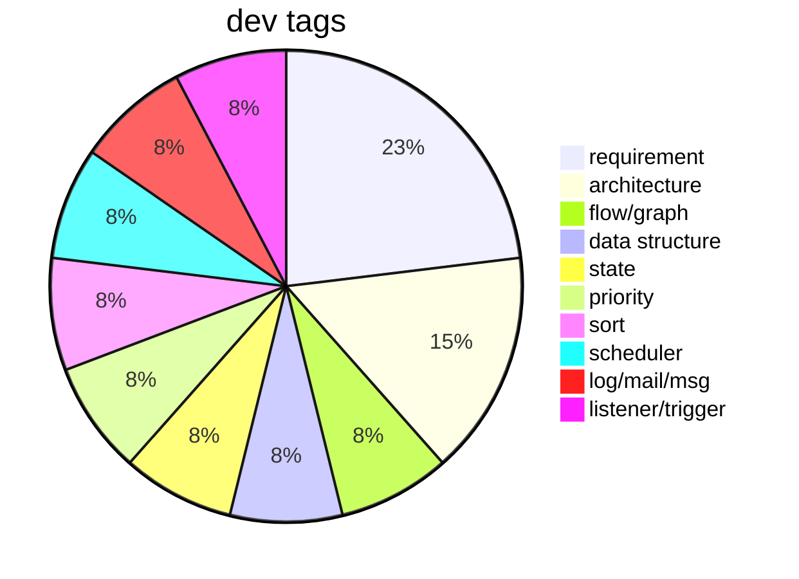

# dos
## bp
### DevOpsSec
#### dev

```mermaid
pie title dev tags
    "requirement" : 3
    "architecture" : 2
    "flow/graph" : 1
    "data structure" : 1
    "state":1
    "priority":1
    "sort":1
    "scheduler":1
    "log/mail/msg":1
    "listener/trigger":1
```

```mermaid
classDiagram 
    class ApplicationContext
    class EnvironmentCapable
    class ListableBeanFactory
    class HierarchicalBeanFactory
    class MessageSource
    class ApplicationEventPublisher
    class ResourcePatternResolver


    class Scope
    class Supplier


    class SpringApplication
    class DefaultBootstrapContext
    class ConfigurableBootstrapContext
    class BootstrapRegistry
    class BootstrapContext
    class ApplicationEventMulticaster
    class SimpleApplicationEventMulticaster
    class Executor
    class ErrorHandler
    class AbstractApplicationEventMulticaster
    class BeanClassLoaderAware
    class BeanFactoryAware
    class DefaultListenerRetriever

```

#### p1
#### p1

### references
#### links
- <>