### other examples

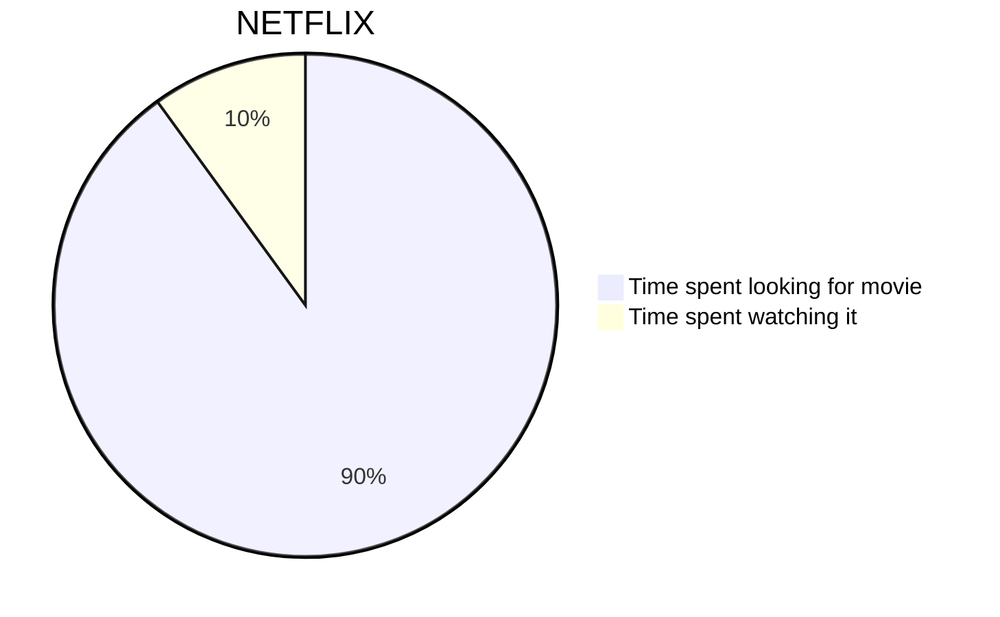
```mermaid
pie title NETFLIX
         "Time spent looking for movie" : 90
         "Time spent watching it" : 10
```

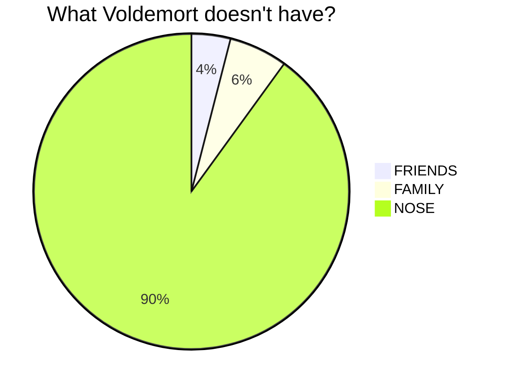
```mermaid
pie title What Voldemort doesn't have?
         "FRIENDS" : 2
         "FAMILY" : 3
         "NOSE" : 45
```

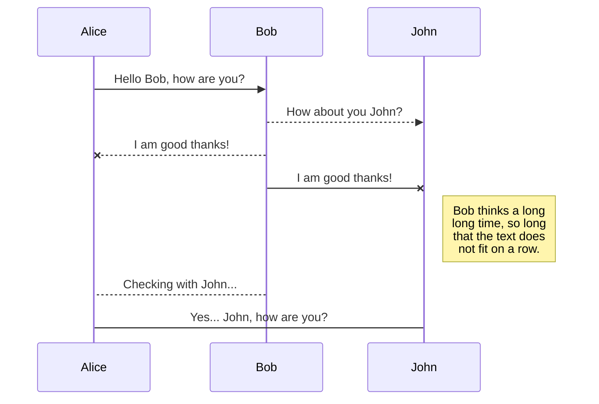
```mermaid
sequenceDiagram
    Alice ->> Bob: Hello Bob, how are you?
    Bob-->>John: How about you John?
    Bob--x Alice: I am good thanks!
    Bob-x John: I am good thanks!
    Note right of John: Bob thinks a long<br/>long time, so long<br/>that the text does<br/>not fit on a row.

    Bob-->Alice: Checking with John...
    Alice->John: Yes... John, how are you?
```

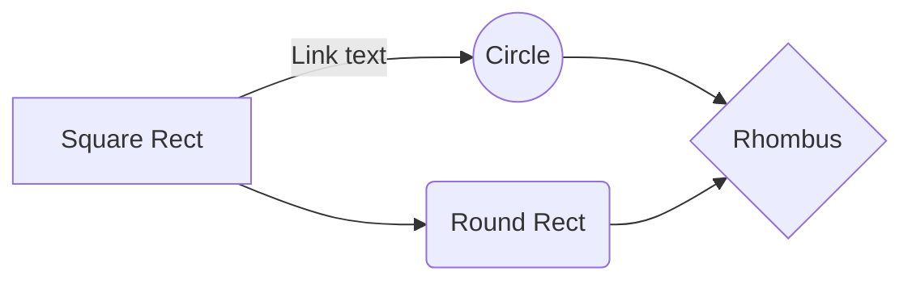
```mermaid
graph LR
    A[Square Rect] -- Link text --> B((Circle))
    A --> C(Round Rect)
    B --> D{Rhombus}
    C --> D
```

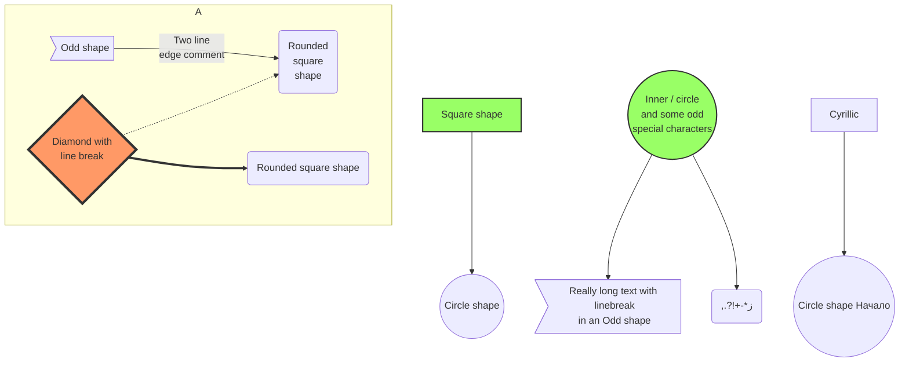
```mermaid
graph TB
    sq[Square shape] --> ci((Circle shape))

    subgraph A
        od>Odd shape]-- Two line<br/>edge comment --> ro
        di{Diamond with <br/> line break} -.-> ro(Rounded<br>square<br>shape)
        di==>ro2(Rounded square shape)
    end

    %% Notice that no text in shape are added here instead that is appended further down
    e --> od3>Really long text with linebreak<br>in an Odd shape]

    %% Comments after double percent signs
    e((Inner / circle<br>and some odd <br>special characters)) --> f(,.?!+-*ز)

    cyr[Cyrillic]-->cyr2((Circle shape Начало));

     classDef green fill:#9f6,stroke:#333,stroke-width:2px;
     classDef orange fill:#f96,stroke:#333,stroke-width:4px;
     class sq,e green
     class di orange
```

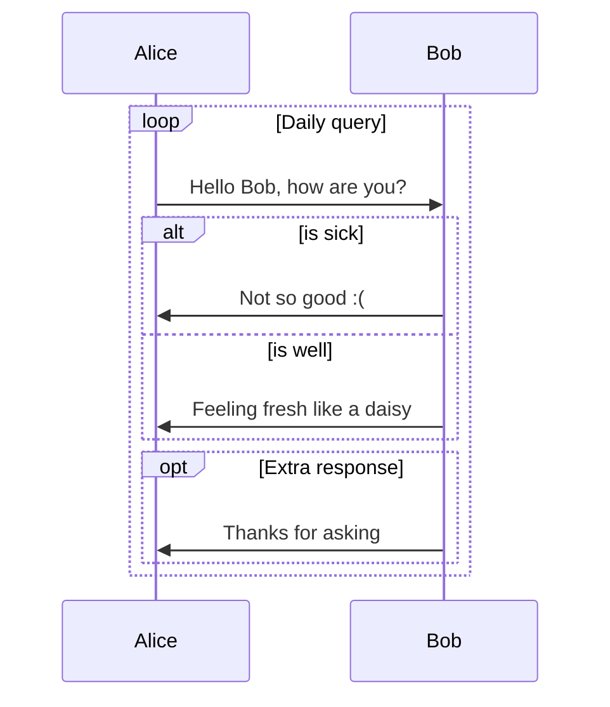
```mermaid
sequenceDiagram
    loop Daily query
        Alice->>Bob: Hello Bob, how are you?
        alt is sick
            Bob->>Alice: Not so good :(
        else is well
            Bob->>Alice: Feeling fresh like a daisy
        end

        opt Extra response
            Bob->>Alice: Thanks for asking
        end
    end
```

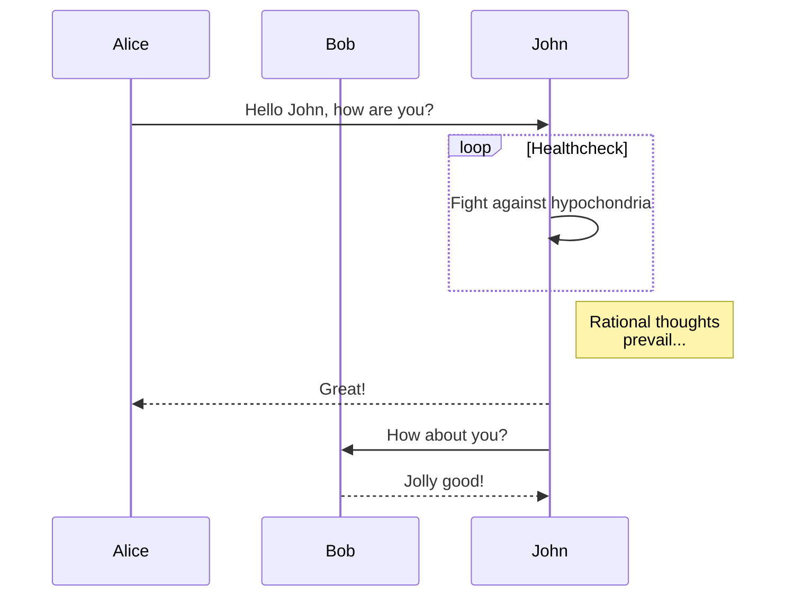
```mermaid
sequenceDiagram
    participant Alice
    participant Bob
    Alice->>John: Hello John, how are you?
    loop Healthcheck
        John->>John: Fight against hypochondria
    end
    Note right of John: Rational thoughts<br/>prevail...
    John-->>Alice: Great!
    John->>Bob: How about you?
    Bob-->>John: Jolly good!
```

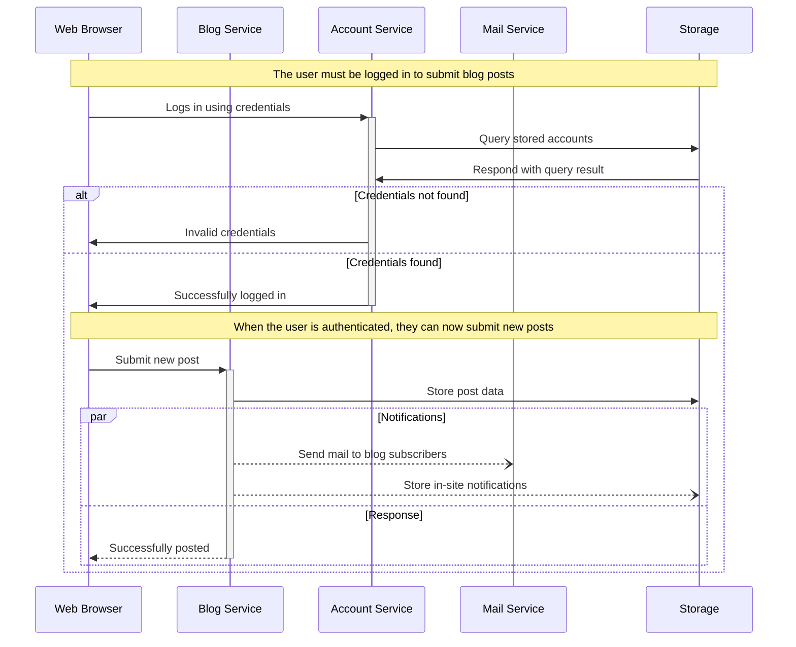
```mermaid
sequenceDiagram
    participant web as Web Browser
    participant blog as Blog Service
    participant account as Account Service
    participant mail as Mail Service
    participant db as Storage

    Note over web,db: The user must be logged in to submit blog posts
    web->>+account: Logs in using credentials
    account->>db: Query stored accounts
    db->>account: Respond with query result

    alt Credentials not found
        account->>web: Invalid credentials
    else Credentials found
        account->>-web: Successfully logged in

        Note over web,db: When the user is authenticated, they can now submit new posts
        web->>+blog: Submit new post
        blog->>db: Store post data

        par Notifications
            blog--)mail: Send mail to blog subscribers
            blog--)db: Store in-site notifications
        and Response
            blog-->>-web: Successfully posted
        end
    end
```

```mermaid

```

```mermaid

```

```mermaid

```

---
---
**Requirement Diagram**

```text
Requirement
A requirement definition contains a requirement type, name, id, text, risk, and verification method. The syntax follows:

<type> user_defined_name {
    id: user_defined_id
    text: user_defined text
    risk: <risk>
    verifymethod: <method>
}
Type, risk, and method are enumerations defined in SysML.

Keyword	Options
Type	requirement, functionalRequirement, interfaceRequirement, performanceRequirement, physicalRequirement, designConstraint
Risk	Low, Medium, High
VerificationMethod	Analysis, Inspection, Test, Demonstration
Element
An element definition contains an element name, type, and document reference. These three are all user defined. The element feature is intended to be lightweight but allow requirements to be connected to portions of other documents.

element user_defined_name {
    type: user_defined_type
    docref: user_defined_ref
}
Relationship
Relationships are comprised of a source node, destination node, and relationship type.

Each follows the definition format of

{name of source} - <type> -> {name of destination}
or

{name of destination} <- <type> - {name of source}
"name of source" and "name of destination" should be names of requirement or element nodes defined elsewhere.

A relationship type can be one of contains, copies, derives, satisfies, verifies, refines, or traces.

Each relationship is labeled in the diagram.
```

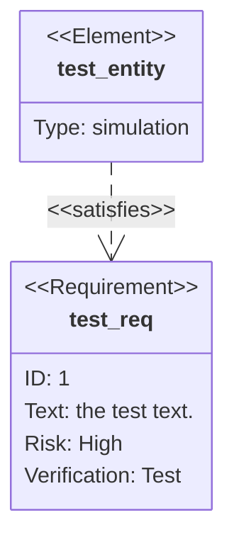
```mermaid
    requirementDiagram

    requirement test_req {
    id: 1
    text: the test text.
    risk: high
    verifymethod: test
    }

    element test_entity {
    type: simulation
    }

    test_entity - satisfies -> test_req
```

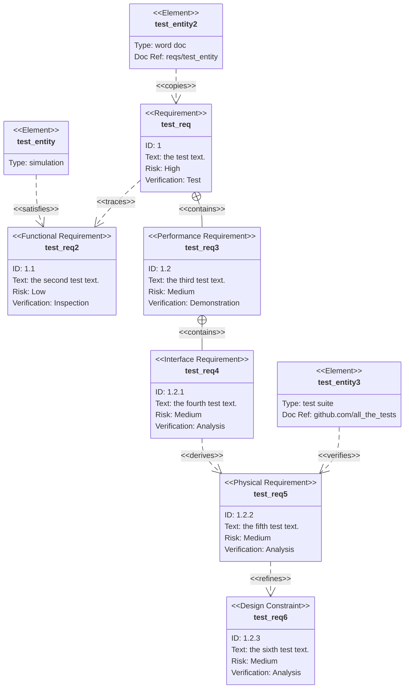
```mermaid
    requirementDiagram

    requirement test_req {
    id: 1
    text: the test text.
    risk: high
    verifymethod: test
    }

    functionalRequirement test_req2 {
    id: 1.1
    text: the second test text.
    risk: low
    verifymethod: inspection
    }

    performanceRequirement test_req3 {
    id: 1.2
    text: the third test text.
    risk: medium
    verifymethod: demonstration
    }

    interfaceRequirement test_req4 {
    id: 1.2.1
    text: the fourth test text.
    risk: medium
    verifymethod: analysis
    }

    physicalRequirement test_req5 {
    id: 1.2.2
    text: the fifth test text.
    risk: medium
    verifymethod: analysis
    }

    designConstraint test_req6 {
    id: 1.2.3
    text: the sixth test text.
    risk: medium
    verifymethod: analysis
    }

    element test_entity {
    type: simulation
    }

    element test_entity2 {
    type: word doc
    docRef: reqs/test_entity
    }

    element test_entity3 {
    type: "test suite"
    docRef: github.com/all_the_tests
    }


    test_entity - satisfies -> test_req2
    test_req - traces -> test_req2
    test_req - contains -> test_req3
    test_req3 - contains -> test_req4
    test_req4 - derives -> test_req5
    test_req5 - refines -> test_req6
    test_entity3 - verifies -> test_req5
    test_req <- copies - test_entity2
```

---
---


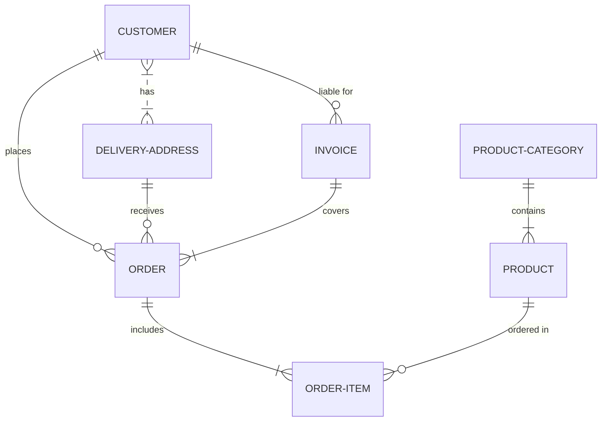
```mermaid
erDiagram
          CUSTOMER }|..|{ DELIVERY-ADDRESS : has
          CUSTOMER ||--o{ ORDER : places
          CUSTOMER ||--o{ INVOICE : "liable for"
          DELIVERY-ADDRESS ||--o{ ORDER : receives
          INVOICE ||--|{ ORDER : covers
          ORDER ||--|{ ORDER-ITEM : includes
          PRODUCT-CATEGORY ||--|{ PRODUCT : contains
          PRODUCT ||--o{ ORDER-ITEM : "ordered in"
```

```text
Relationship Syntax
The relationship part of each statement can be broken down into three sub-components:

the cardinality of the first entity with respect to the second,
whether the relationship confers identity on a 'child' entity
the cardinality of the second entity with respect to the first
Cardinality is a property that describes how many elements of another entity can be related to the entity in question. In the above example a PROPERTY can have one or more ROOM instances associated to it, whereas a ROOM can only be associated with one PROPERTY. In each cardinality marker there are two characters. The outermost character represents a maximum value, and the innermost character represents a minimum value. The table below summarises possible cardinalities.

Value (left)	Value (right)	Meaning
|o	o|	Zero or one
||	||	Exactly one
}o	o{	Zero or more (no upper limit)
}|	|{	One or more (no upper limit)
```

```text
    CUSTOMER ||--o{ ORDER : places
    ORDER ||--|{ LINE-ITEM : contains
    CUSTOMER }|..|{ DELIVERY-ADDRESS : uses
```
```text
erDiagram
    CUSTOMER ||--o{ ORDER : places
    CUSTOMER {
        string name
        string custNumber
        string sector
    }
    ORDER ||--|{ LINE-ITEM : contains
    ORDER {
        int orderNumber
        string deliveryAddress
    }
    LINE-ITEM {
        string productCode
        int quantity
        float pricePerUnit
    }
```

```text
Entities and Relationships
Mermaid syntax for ER diagrams is compatible with PlantUML, with an extension to label the relationship. Each statement consists of the following parts:

    <first-entity> [<relationship> <second-entity> : <relationship-label>]
Where:

first-entity is the name of an entity. Names must begin with an alphabetic character and may also contain digits, hyphens, and underscores.
relationship describes the way that both entities inter-relate. See below.
second-entity is the name of the other entity.
relationship-label describes the relationship from the perspective of the first entity.
For example:

    PROPERTY ||--|{ ROOM : contains
```


---
---

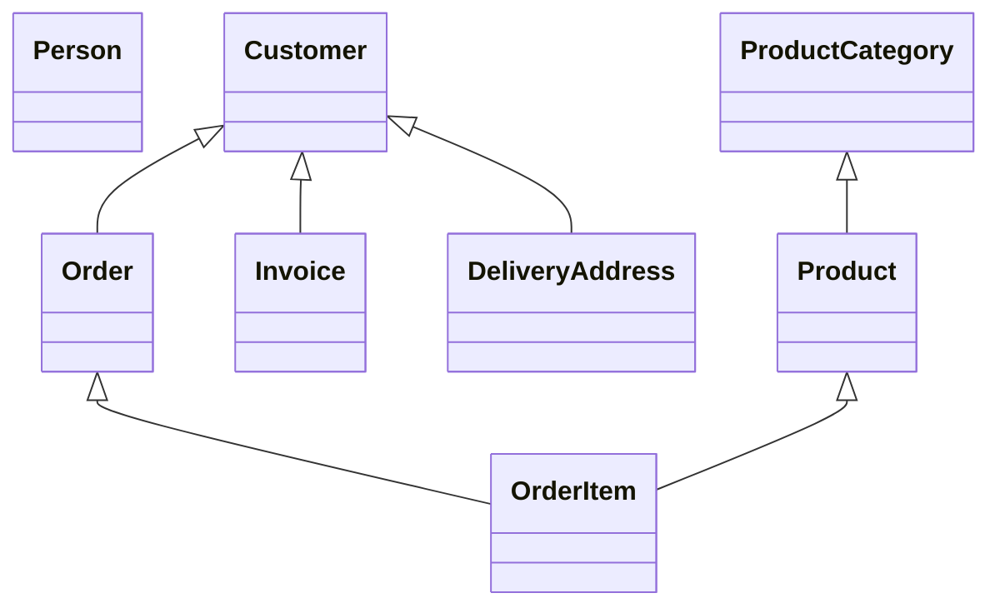
```mermaid
classDiagram
    class Person
    class Customer
    class Order
    class Invoice
    class DeliveryAddress
    Customer <|-- Order
    Customer <|-- Invoice
    Customer <|-- DeliveryAddress
    Order <|-- OrderItem
    Product <|-- OrderItem
    ProductCategory <|-- Product
```
```text
Type	Description
<|--	Inheritance
*--	Composition
o--	Aggregation
-->	Association
--	Link (Solid)
..>	Dependency
..|>	Realization
..	Link (Dashed)
```

```text
To specify the visibility of a class member (i.e. any attribute or method), these notations may be placed before the member's name, but it is optional:

+ Public
- Private
# Protected
~ Package/Internal
```

``` text
The different cardinality options are :

1 Only 1
0..1 Zero or One
1..* One or more
* Many
n n {where n>1}
0..n zero to n {where n>1}
1..n one to n {where n>1}

 Customer "1" --> "*" Ticket
```


```text
<<Interface>> To represent an Interface class
<<abstract>> To represent an abstract class
<<Service>> To represent a service class
<<enumeration>> To represent an enum

classDiagram
class Shape
<<interface>> Shape
Shape : noOfVertices
Shape : draw()
```

```text
classDiagram
%% This whole line is a comment classDiagram class Shape <<interface>>
class Shape{
    <<interface>>
    noOfVertices
    draw()
}
```

---
---

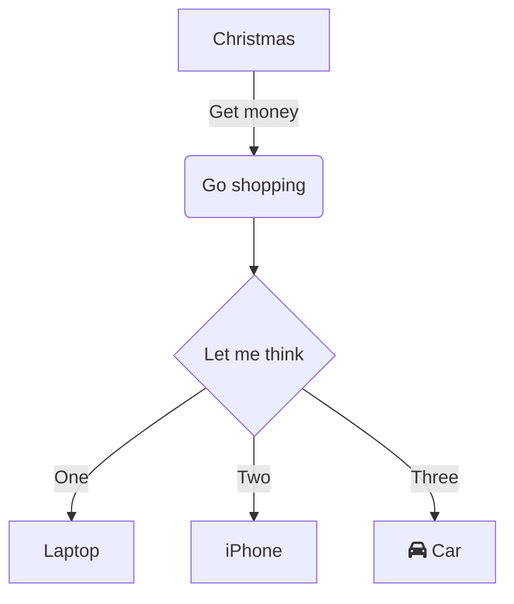
```mermaid
graph TD
    A[Christmas] -->|Get money| B(Go shopping)
    B --> C{Let me think}
    C -->|One| D[Laptop]
    C -->|Two| E[iPhone]
    C -->|Three| F[fa:fa-car Car]
```
    
---
---

```text
Messages
Messages can be of two displayed either solid or with a dotted line.

[Actor][Arrow][Actor]:Message text
There are six types of arrows currently supported:

Type	Description
->	Solid line without arrow
-->	Dotted line without arrow
->>	Solid line with arrowhead
-->>	Dotted line with arrowhead
-x	Solid line with a cross at the end
--x	Dotted line with a cross at the end.
-)	Solid line with an open arrow at the end (async)
--)	Dotted line with a open arrow at the end (async)
```

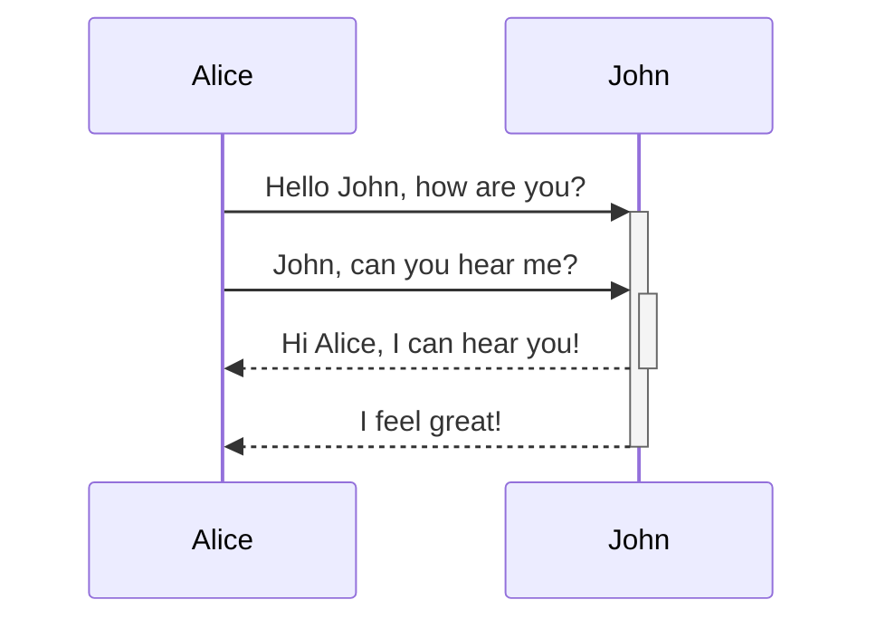
```mermaid
sequenceDiagram
    Alice->>+John: Hello John, how are you?
    Alice->>+John: John, can you hear me?
    John-->>-Alice: Hi Alice, I can hear you!
    John-->>-Alice: I feel great!        
```

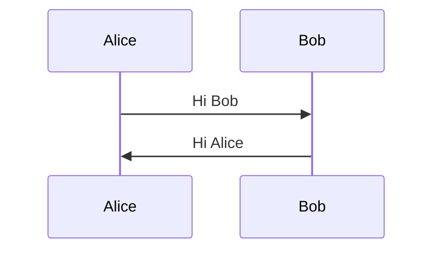
```mermaid
sequenceDiagram
    participant Alice
    participant Bob
    Alice->>Bob: Hi Bob
    Bob->>Alice: Hi Alice
```


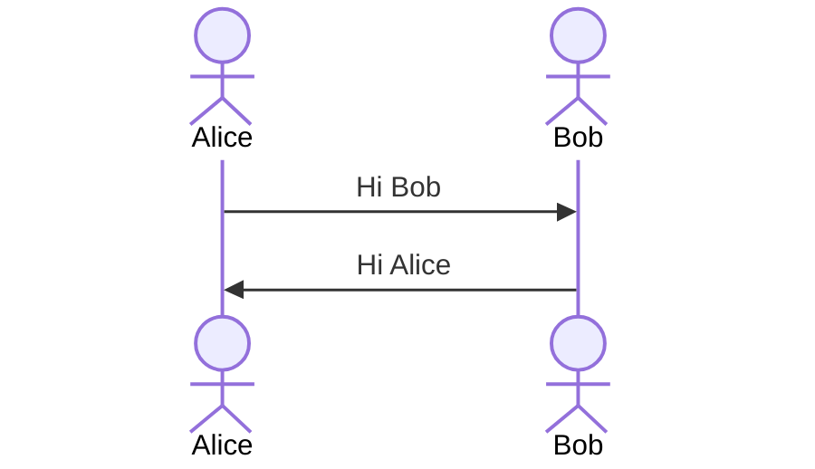
```mermaid
sequenceDiagram
    actor Alice
    actor Bob
    Alice->>Bob: Hi Bob
    Bob->>Alice: Hi Alice
```

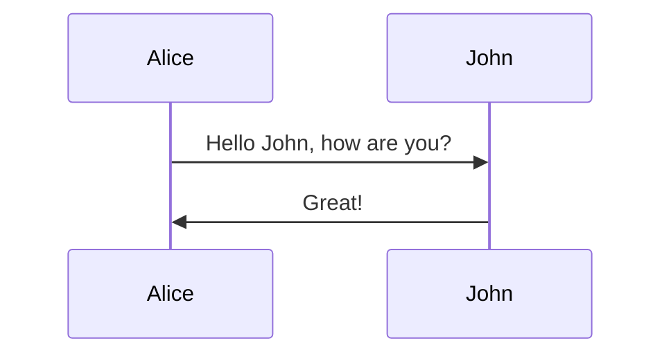
```mermaid
sequenceDiagram
    participant A as Alice
    participant J as John
    A->>J: Hello John, how are you?
    J->>A: Great!
```

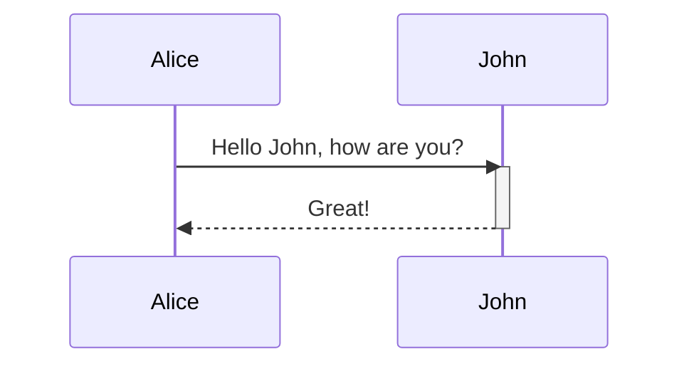
```mermaid
sequenceDiagram
    Alice->>John: Hello John, how are you?
    activate John
    John-->>Alice: Great!
    deactivate John
```

```mermaid
sequenceDiagram
    Alice->>+John: Hello John, how are you?
    John-->>-Alice: Great!
```

```mermaid
sequenceDiagram
    Alice->>+John: Hello John, how are you?
    Alice->>+John: John, can you hear me?
    John-->>-Alice: Hi Alice, I can hear you!
    John-->>-Alice: I feel great!
```

```mermaid

```

```mermaid

```

```mermaid

```

```mermaid

```

```mermaid

```

```mermaid

```

```mermaid

```

```mermaid

```

```mermaid

```

```mermaid

```

```mermaid

```

```mermaid

```

```mermaid

```

```mermaid

```


---
---
```mermaid
stateDiagram-v2
    [*] --> Still
    Still --> [*]
    Still --> Moving
    Moving --> Still
    Moving --> Crash
    Crash --> [*]
```

```text

    stateDiagram-v2
        State1: The state with a note
        note right of State1
            Important information! You can write
            notes.
        end note
        State1 --> State2
        note left of State2 : This is the note to the left.

stateDiagram-v2
    [*] --> Still
    Still --> [*]
%% this is a comment
    Still --> Moving
    Moving --> Still %% another comment
    Moving --> Crash
    Crash --> [*]

stateDiagram-v2
    s1 --> s2: A transition


    [*] --> First
    state First {
        [*] --> second
        second --> [*]
    }


stateDiagram-v2
    [*] --> First

    state First {
        [*] --> Second

        state Second {
            [*] --> second
            second --> Third

            state Third {
                [*] --> third
                third --> [*]
            }
        }
    }


    [*] --> First
    First --> Second
    First --> Third

    state First {
        [*] --> fir
        fir --> [*]
    }
    state Second {
        [*] --> sec
        sec --> [*]
    }
    state Third {
        [*] --> thi
        thi --> [*]
    }


stateDiagram-v2
    state if_state <<choice>>
    [*] --> IsPositive
    IsPositive --> if_state
    if_state --> False: if n < 0
    if_state --> True : if n >= 0

   stateDiagram-v2
    state fork_state <<fork>>
      [*] --> fork_state
      fork_state --> State2
      fork_state --> State3

      state join_state <<join>>
      State2 --> join_state
      State3 --> join_state
      join_state --> State4
      State4 --> [*]

stateDiagram
    direction LR
    [*] --> A
    A --> B
    B --> C
    state B {
      direction LR
      a --> b
    }
    B --> D

```

---
---
```mermaid
gantt
    title A Gantt Diagram
    dateFormat  YYYY-MM-DD
    section Section
    A task           :a1, 2014-01-01, 30d
    Another task     :after a1  , 20d
    section Another
    Task in sec      :2014-01-12  , 12d
    another task      : 24d
```

---
---
```mermaid
pie title Pets adopted by volunteers
    "Dogs" : 386
    "Cats" : 85
    "Rats" : 15
            
```

---
---
```mermaid
  journey
    title My working day
    section Go to work
      Make tea: 5: Me
      Go upstairs: 3: Me
      Do work: 1: Me, Cat
    section Go home
      Go downstairs: 5: Me
      Sit down: 3: Me
      
```

---
---
```mermaid
    gitGraph
      commit
      commit
      branch develop
      checkout develop
      commit
      commit
      checkout main
      merge develop
      commit
      commit

```

---
---
---

```mermaid
    flowchart TB
      subgraph one
        a1 --> a2
      end
      subgraph two
        b1 --> b2
      end
      subgraph three
        c1 --> c2
      end
      a1 --> b1
      b1 --> c1
      c1 --> a1
```


```mermaid
flowchart LR
   a --> b & c--> d
```

```mermaid
   A o--o B
    B <--> C
    C x--x D
```

```mermaid
 A[Start] --> B{Is it?}
    B -->|Yes| C[OK]
    C --> D[Rethink]
    D --> B
    B ---->|No| E[End]
```

```mermaid
flowchart TD
    A[Start] --> B{Is it?}
    B -- Yes --> C[OK]
    C --> D[Rethink]
    D --> B
    B -- No ----> E[End]
```

```mermaid
flowchart TB
    c1-->a2
    subgraph one
    a1-->a2
    end
    subgraph two
    b1-->b2
    end
    subgraph three
    c1-->c2
    end
```

```mermaid
flowchart TB
    c1-->a2
    subgraph ide1 [one]
    a1-->a2
    end
```

```mermaid
flowchart TB
    c1-->a2
    subgraph one
    a1-->a2
    end
    subgraph two
    b1-->b2
    end
    subgraph three
    c1-->c2
    end
    one --> two
    three --> two
    two --> c2
```

```mermaid
flowchart LR
  subgraph TOP
    direction TB
    subgraph B1
        direction RL
        i1 -->f1
    end
    subgraph B2
        direction BT
        i2 -->f2
    end
  end
  A --> TOP --> B
  B1 --> B2
```

```mermaid
flowchart LR
%% this is a comment A -- text --> B{node}
   A -- text --> B -- text2 --> C
```

```mermaid
flowchart TD
    B["fab:fa-twitter for peace"]
    B-->C[fa:fa-ban forbidden]
    B-->D(fa:fa-spinner);
    B-->E(A fa:fa-camera-retro perhaps?)
```

```mermaid
flowchart LR
    A[Hard edge] -->|Link text| B(Round edge)
    B --> C{Decision}
    C -->|One| D[Result one]
    C -->|Two| E[Result two]
```


```text
flowchart


A node with round edges
flowchart LR
    id1(This is the text in the box)

A stadium-shaped node
flowchart LR
    id1([This is the text in the box])

A node in a subroutine shape
flowchart LR
    id1[[This is the text in the box]]

A node in a cylindrical shape
flowchart LR
    id1[(Database)]

A node in the form of a circle
flowchart LR
    id1((This is the text in the circle))

A node in an asymmetric shape
flowchart LR
    id1>This is the text in the box]

A node (rhombus)
flowchart LR
    id1{This is the text in the box}

A hexagon node
flowchart LR
    id1{{This is the text in the box}}

Parallelogram
flowchart TD
    id1[/This is the text in the box/]

Parallelogram alt
flowchart TD
    id1[\This is the text in the box\]

Trapezoid alt
flowchart TD
    B[\Go shopping/]

Double circle
flowchart TD
    id1(((This is the text in the circle)))
--
Minimum length of a link
Each node in the flowchart is ultimately assigned to a rank in the rendered graph, i.e. to a vertical or horizontal level (depending on the flowchart orientation), based on the nodes to which it is linked. By default, links can span any number of ranks, but you can ask for any link to be longer than the others by adding extra dashes in the link definition.

In the following example, two extra dashes are added in the link from node B to node E, so that it spans two more ranks than regular links:

flowchart TD
    A[Start] --> B{Is it?}
    B -->|Yes| C[OK]
    C --> D[Rethink]
    D --> B
    B ---->|No| E[End]
Yes
No
Start
Is it?
OK
Rethink
End
Note Links may still be made longer than the requested number of ranks by the rendering engine to accommodate other requests.

When the link label is written in the middle of the link, the extra dashes must be added on the right side of the link. The following example is equivalent to the previous one:

flowchart TD
    A[Start] --> B{Is it?}
    B -- Yes --> C[OK]
    C --> D[Rethink]
    D --> B
    B -- No ----> E[End]
Yes
No
Start
Is it?
OK
Rethink
End
For dotted or thick links, the characters to add are equals signs or dots, as summed up in the following table:

Length	1	2	3
Normal	---	----	-----
Normal with arrow	-->	--->	---->
Thick	===	====	=====
Thick with arrow	==>	===>	====>
Dotted	-.-	-..-	-...-
Dotted with arrow	-.->	-..->	-...->
--
flowcharts
With the graphtype flowchart it is also possible to set edges to and from subgraphs as in the flowchart below.

flowchart TB
    c1-->a2
    subgraph one
    a1-->a2
    end
    subgraph two
    b1-->b2
    end
    subgraph three
    c1-->c2
    end
    one --> two
    three --> two
    two --> c2

--
Direction in subgraphs
With the graphtype flowcharts you can use the direction statement to set the direction which the subgraph will render like in this example.

flowchart LR
  subgraph TOP
    direction TB
    subgraph B1
        direction RL
        i1 -->f1
    end
    subgraph B2
        direction BT
        i2 -->f2
    end
  end
  A --> TOP --> B
  B1 --> B2
  --
Basic support for fontawesome
It is possible to add icons from fontawesome.

The icons are accessed via the syntax fa:#icon class name#.

flowchart TD
    B["fab:fa-twitter for peace"]
    B-->C[fa:fa-ban forbidden]
    B-->D(fa:fa-spinner);
    B-->E(A fa:fa-camera-retro perhaps?)
--
Graph declarations with spaces between vertices and link and without semicolon
In graph declarations, the statements also can now end without a semicolon. After release 0.2.16, ending a graph statement with semicolon is just optional. So the below graph declaration is also valid along with the old declarations of the graph.

A single space is allowed between vertices and the link. However there should not be any space between a vertex and its text and a link and its text. The old syntax of graph declaration will also work and hence this new feature is optional and is introduced to improve readability.

Below is the new declaration of the graph edges which is also valid along with the old declaration of the graph edges.

flowchart LR
    A[Hard edge] -->|Link text| B(Round edge)
    B --> C{Decision}
    C -->|One| D[Result one]
    C -->|Two| E[Result two]

```