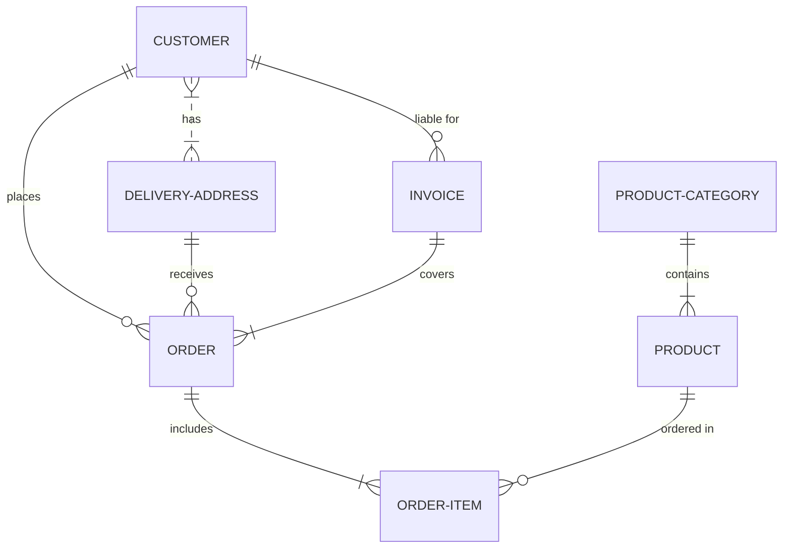
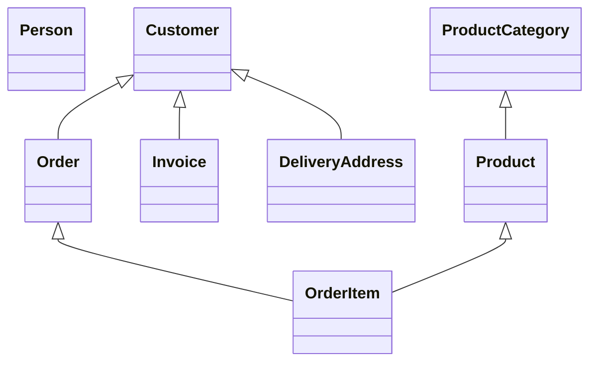
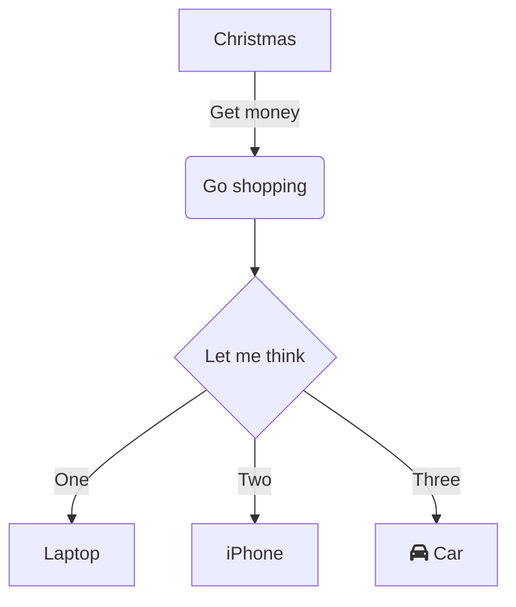
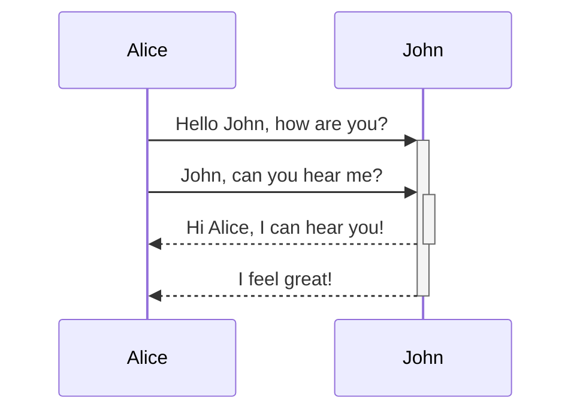
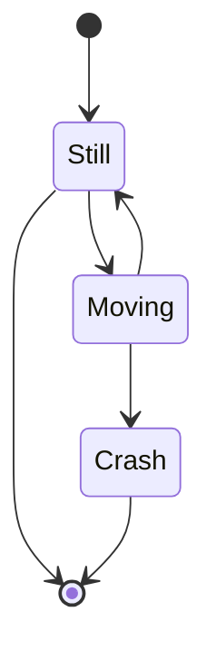
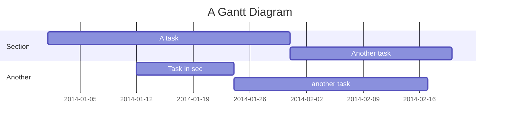
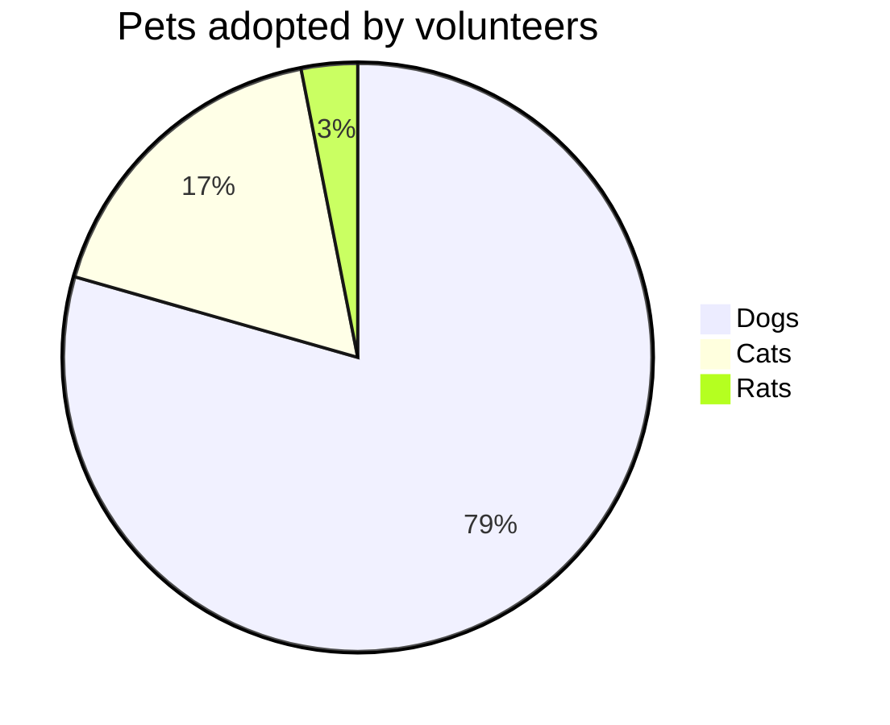
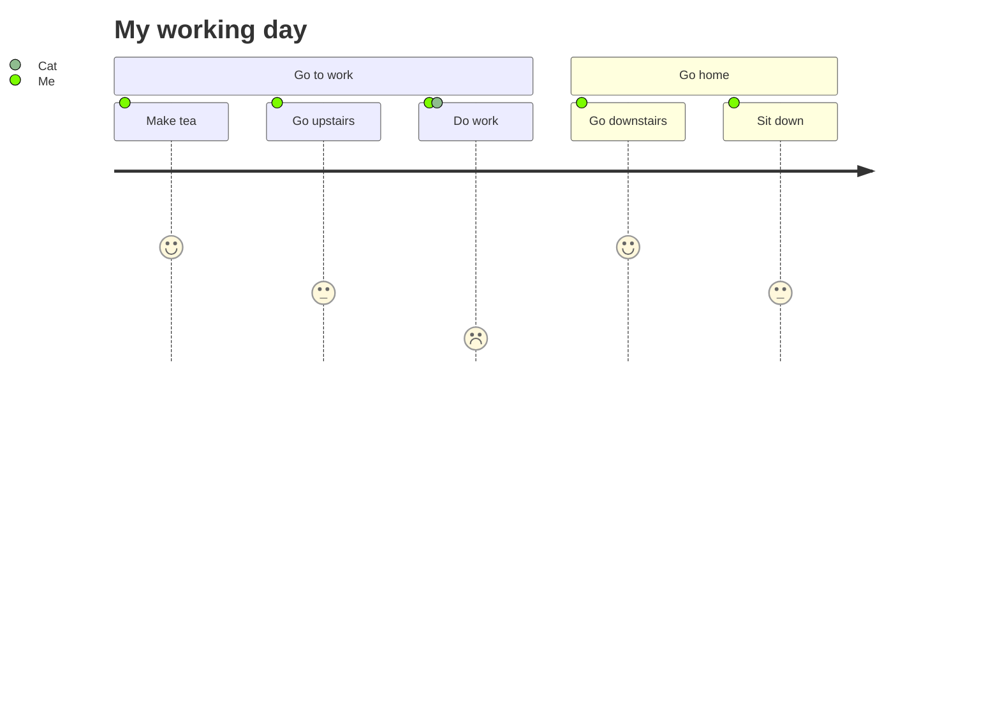
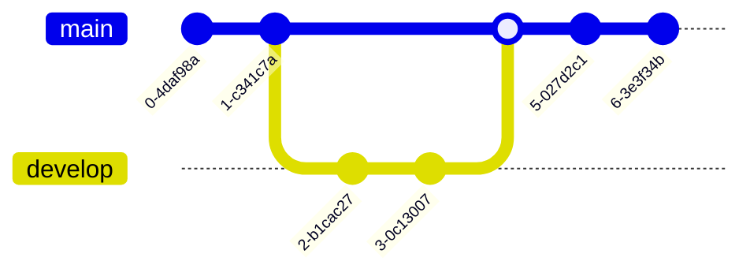

---
---


```text
Type	Description
<|--	Inheritance
*--	Composition
o--	Aggregation
-->	Association
--	Link (Solid)
..>	Dependency
..|>	Realization
..	Link (Dashed)
```
``` text
The different cardinality options are :

1 Only 1
0..1 Zero or One
1..* One or more
* Many
n n {where n>1}
0..n zero to n {where n>1}
1..n one to n {where n>1}

 Customer "1" --> "*" Ticket
```


```text
<<Interface>> To represent an Interface class
<<abstract>> To represent an abstract class
<<Service>> To represent a service class
<<enumeration>> To represent an enum

classDiagram
class Shape
<<interface>> Shape
Shape : noOfVertices
Shape : draw()
```

```text
classDiagram
%% This whole line is a comment classDiagram class Shape <<interface>>
class Shape{
    <<interface>>
    noOfVertices
    draw()
}
```

---
---


    
---
---



---
---


---
---


---
---


---
---


---
---


