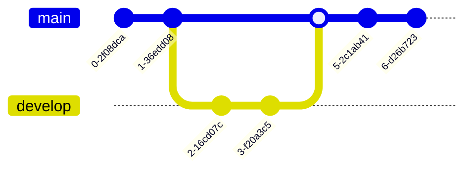

```text
Relationship Syntax
The relationship part of each statement can be broken down into three sub-components:

the cardinality of the first entity with respect to the second,
whether the relationship confers identity on a 'child' entity
the cardinality of the second entity with respect to the first
Cardinality is a property that describes how many elements of another entity can be related to the entity in question. In the above example a PROPERTY can have one or more ROOM instances associated to it, whereas a ROOM can only be associated with one PROPERTY. In each cardinality marker there are two characters. The outermost character represents a maximum value, and the innermost character represents a minimum value. The table below summarises possible cardinalities.

Value (left)	Value (right)	Meaning
|o	o|	Zero or one
||	||	Exactly one
}o	o{	Zero or more (no upper limit)
}|	|{	One or more (no upper limit)
```

```text
    CUSTOMER ||--o{ ORDER : places
    ORDER ||--|{ LINE-ITEM : contains
    CUSTOMER }|..|{ DELIVERY-ADDRESS : uses
```
```text
erDiagram
    CUSTOMER ||--o{ ORDER : places
    CUSTOMER {
        string name
        string custNumber
        string sector
    }
    ORDER ||--|{ LINE-ITEM : contains
    ORDER {
        int orderNumber
        string deliveryAddress
    }
    LINE-ITEM {
        string productCode
        int quantity
        float pricePerUnit
    }
```

```text
Entities and Relationships
Mermaid syntax for ER diagrams is compatible with PlantUML, with an extension to label the relationship. Each statement consists of the following parts:

    <first-entity> [<relationship> <second-entity> : <relationship-label>]
Where:

first-entity is the name of an entity. Names must begin with an alphabetic character and may also contain digits, hyphens, and underscores.
relationship describes the way that both entities inter-relate. See below.
second-entity is the name of the other entity.
relationship-label describes the relationship from the perspective of the first entity.
For example:

    PROPERTY ||--|{ ROOM : contains
```


---
---


```text
Type	Description
<|--	Inheritance
*--	Composition
o--	Aggregation
-->	Association
--	Link (Solid)
..>	Dependency
..|>	Realization
..	Link (Dashed)
```

```text
To specify the visibility of a class member (i.e. any attribute or method), these notations may be placed before the member's name, but it is optional:

+ Public
- Private
# Protected
~ Package/Internal
```

``` text
The different cardinality options are :

1 Only 1
0..1 Zero or One
1..* One or more
* Many
n n {where n>1}
0..n zero to n {where n>1}
1..n one to n {where n>1}

 Customer "1" --> "*" Ticket
```


```text
<<Interface>> To represent an Interface class
<<abstract>> To represent an abstract class
<<Service>> To represent a service class
<<enumeration>> To represent an enum

classDiagram
class Shape
<<interface>> Shape
Shape : noOfVertices
Shape : draw()
```

```text
classDiagram
%% This whole line is a comment classDiagram class Shape <<interface>>
class Shape{
    <<interface>>
    noOfVertices
    draw()
}
```

---
---


    
---
---


---
---


---
---


---
---


---
---


---
---


---
---
---

