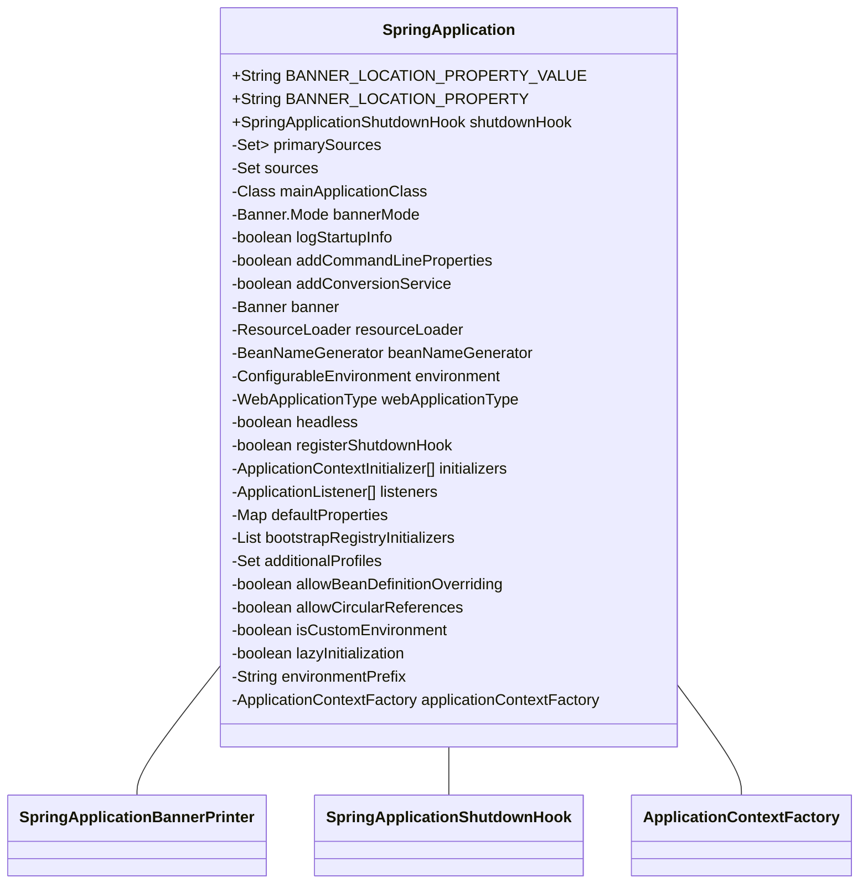
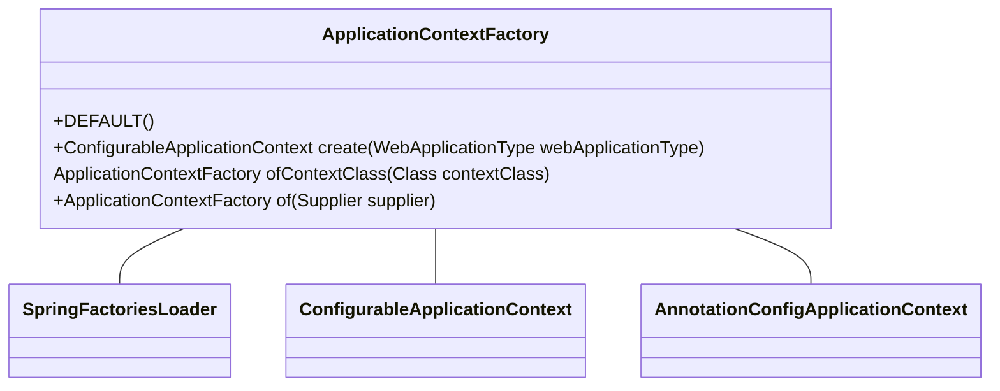
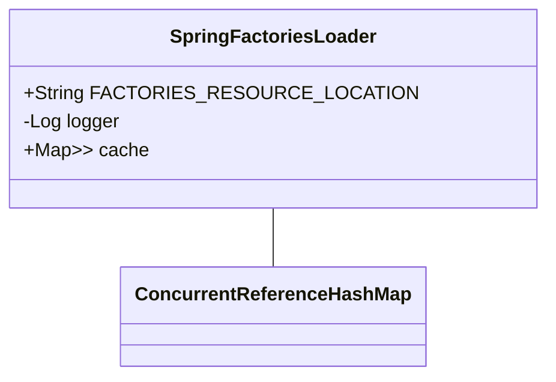
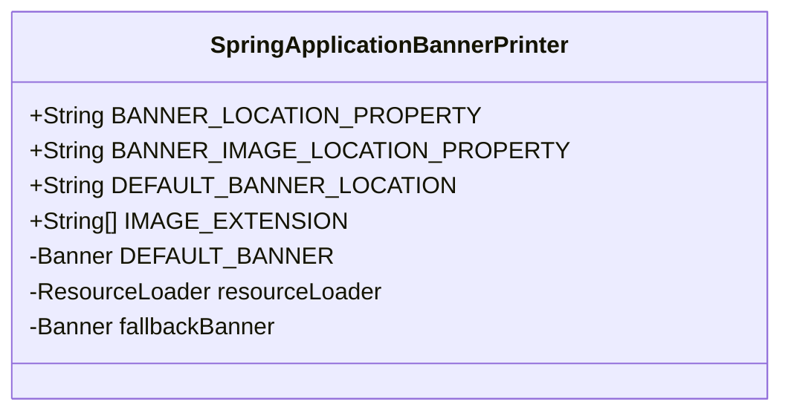
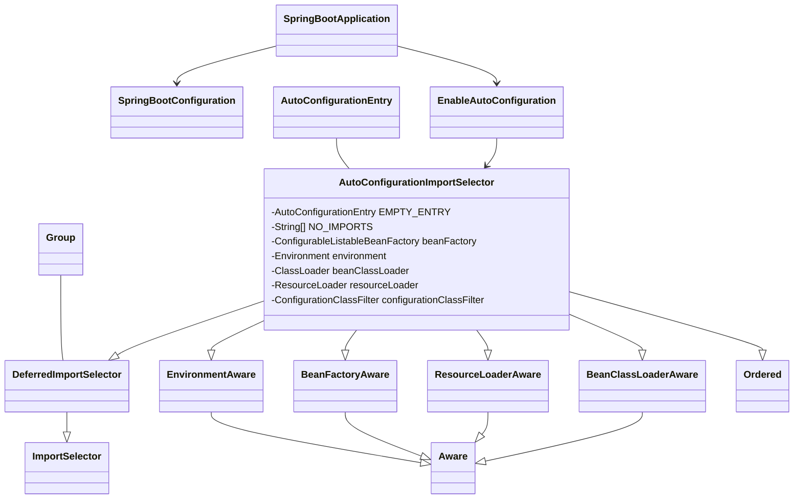
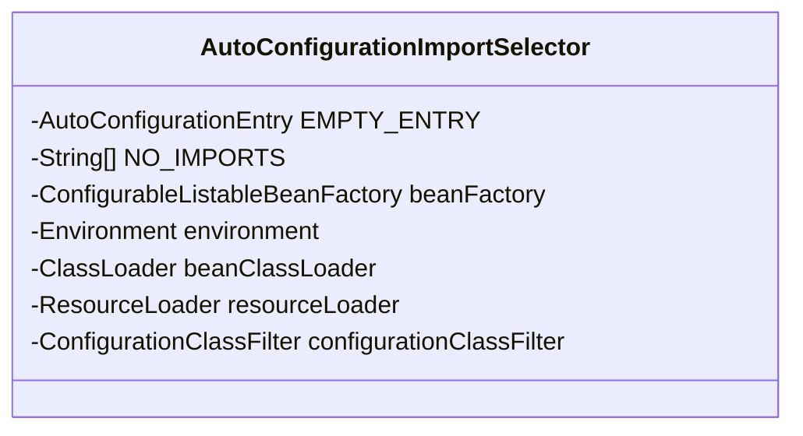
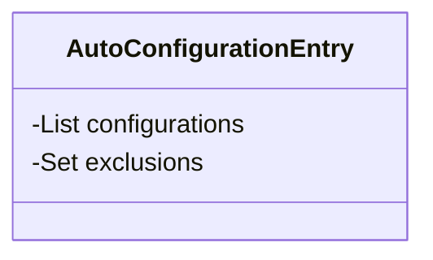

```mermaid
graph TD
  subgraph SpringApplication
        sb1[SpringApplication] --Springdemo1Application.class, args--> sb1-2[run]
        sb1-2 -- new -->sb1-3[SpringApplication]
        sb1-3 --deduceFromClasspath --> sb2[WebApplicationType] --> sb2-1[WebApplicationType.deduceFromClasspath]
        sb1-3 --BootstrapRegistryInitializer-->sb1-5[getSpringFactoriesInstances]
        sb1-5 --> sb1-6[getClassLoader]

        sb1-6 --type, classLoader--> sb3[SpringFactoriesLoader] --> sb3-1[loadFactoryNames] --ClassLoader classLoader-->sb3-2[SpringFactoriesLoader.loadSpringFactories] --FACTORIES_RESOURCE_LOCATION--> ja1[ClassLoader.getResources]--url-->sc1[UrlResource]--resource-->sc2[PropertiesLoaderUtils]--UrlResource-->sc2-1[loadProperties] -->su1[StringUtils] --String-->su1-1[commaDelimitedListToStringArray]-->ju1[HashMap]-->ju1-1[computeIfAbsent]-->ju1-2[replaceAll]-->ju2[Collectors]-->ju2-1[collectingAndThen]-->ju2-2[toList]-->ju3[Collections]-->ju3-1[unmodifiableList]
        sb3-2 -->ju1-3[getOrDefault]
        sb3-1 -->sb3-3[instantiateFactory] -->su2[ClassUtils] --factoryImplementationName, classLoader-->su2-1[forName]
        -->su3[ReflectionUtils]-->su3-1[accessibleConstructor]-->su3-2[newInstance]
        sb1-3 -->sb12[setInitializers]
        sb3-3 -->sc3[AnnotationAwareOrderComparator]-->sc3-1[sort]
        sb1-3 -->sb13[setListeners]
        sb1-3 -->sb14[deduceMainApplicationClass]
        sb14 -->jl1[RuntimeException] -->jl1-1[getStackTrace]

        sb1-2 -->sb1-7[createBootstrapContext]
        sb1-7 -->sb4[DefaultBootstrapContext]
  end
```

```mermaid
classDiagram
```


```text
sb4
su3
ju3
sc3
jl1
SpringApplication sb1-6

```




---


```text
org.springframework.boot.ApplicationContextFactory.DEFAULT

```

---



---


---
    
 ```mermaid
classDiagram
    Runnable <-- SpringApplicationShutdownHook

    class SpringApplicationShutdownHook
    SpringApplicationShutdownHook :-int SLEEP
    SpringApplicationShutdownHook :-long TIMEOUT
    SpringApplicationShutdownHook :-Log logger
    SpringApplicationShutdownHook :-Handlers handlers
    SpringApplicationShutdownHook :-Set<ConfigurableApplicationContext> contexts
    SpringApplicationShutdownHook :-Set<ConfigurableApplicationContext> closedContexts
    SpringApplicationShutdownHook :-ApplicationContextClosedListener contextCloseListener
    SpringApplicationShutdownHook :-AtomicBoolean shutdownHookAdded
    SpringApplicationShutdownHook :-boolean inProgress
    SpringApplicationShutdownHook :+void run()

 ```


---
---






