# SRC
## Spring
### framework

---
---
---
#### spring core

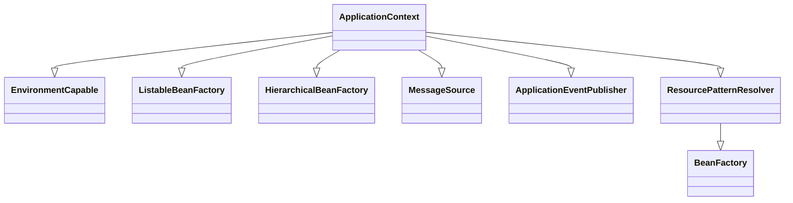
```mermaid
classDiagram
    ApplicationContext --|> EnvironmentCapable
    ApplicationContext --|> ListableBeanFactory
    ApplicationContext --|> HierarchicalBeanFactory
    ApplicationContext --|> MessageSource
    ApplicationContext --|> ApplicationEventPublisher
    ApplicationContext --|> ResourcePatternResolver
   
    ResourcePatternResolver --|> BeanFactory

```

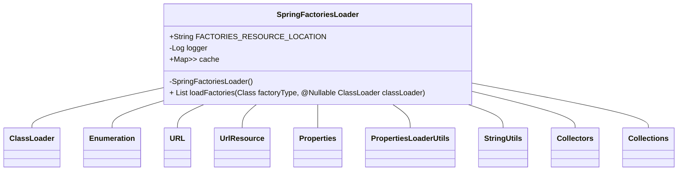
```mermaid
classDiagram
    class SpringFactoriesLoader
    SpringFactoriesLoader: +String FACTORIES_RESOURCE_LOCATION
    SpringFactoriesLoader: -Log logger
    SpringFactoriesLoader: +Map<ClassLoader, Map<String, List<String>>> cache 
    SpringFactoriesLoader: -SpringFactoriesLoader()
    SpringFactoriesLoader: +<T> List<T> loadFactories(Class<T> factoryType, @Nullable ClassLoader classLoader)


    SpringFactoriesLoader -- ClassLoader
    SpringFactoriesLoader -- Enumeration
    SpringFactoriesLoader -- URL
    SpringFactoriesLoader -- UrlResource
    SpringFactoriesLoader -- Properties
    SpringFactoriesLoader -- PropertiesLoaderUtils
    SpringFactoriesLoader -- StringUtils
    SpringFactoriesLoader -- Collectors
    SpringFactoriesLoader -- Collections

```

---
---
---

### Spring context

--
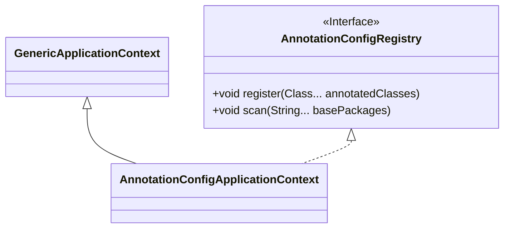
```mermaid
classDiagram
    GenericApplicationContext <|-- AnnotationConfigApplicationContext
    AnnotationConfigRegistry <|.. AnnotationConfigApplicationContext
    class AnnotationConfigApplicationContext 


    class  AnnotationConfigRegistry
    <<Interface>> AnnotationConfigRegistry
    AnnotationConfigRegistry : +void register(Class<?>... annotatedClasses)
    AnnotationConfigRegistry : +void scan(String... basePackages)
```

---
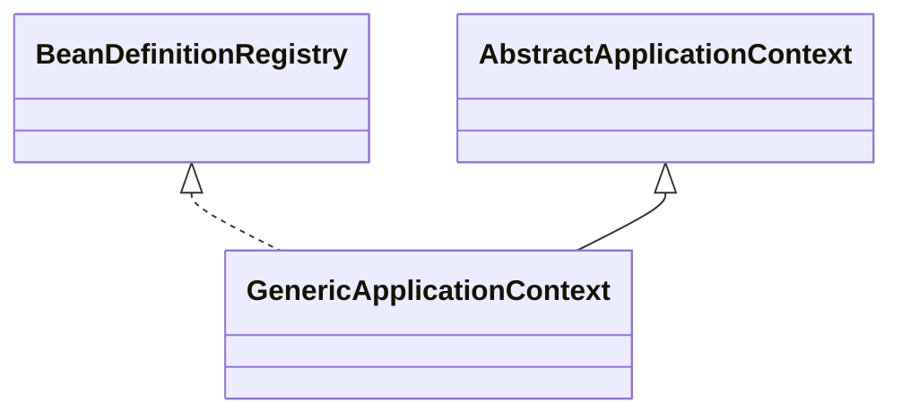
```mermaid
classDiagram
    BeanDefinitionRegistry <|.. GenericApplicationContext
    AbstractApplicationContext <|-- GenericApplicationContext

    class GenericApplicationContext
```

---
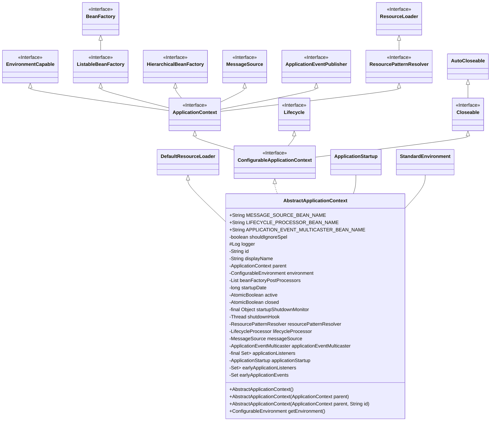
```mermaid
classDiagram
    DefaultResourceLoader <|-- AbstractApplicationContext
    ConfigurableApplicationContext <|.. AbstractApplicationContext

    ApplicationStartup -- AbstractApplicationContext
    StandardEnvironment -- AbstractApplicationContext

    class AbstractApplicationContext
    AbstractApplicationContext: +String MESSAGE_SOURCE_BEAN_NAME
    AbstractApplicationContext: +String LIFECYCLE_PROCESSOR_BEAN_NAME
    AbstractApplicationContext: +String APPLICATION_EVENT_MULTICASTER_BEAN_NAME
    AbstractApplicationContext: -boolean shouldIgnoreSpel
    AbstractApplicationContext: #Log logger
    AbstractApplicationContext: -String id
    AbstractApplicationContext: -String displayName
    AbstractApplicationContext: -ApplicationContext parent
    AbstractApplicationContext: -ConfigurableEnvironment environment
    AbstractApplicationContext: -List<BeanFactoryPostProcessor> beanFactoryPostProcessors
    AbstractApplicationContext: -long startupDate
    AbstractApplicationContext: -AtomicBoolean active
    AbstractApplicationContext: -AtomicBoolean closed
    AbstractApplicationContext: -final Object startupShutdownMonitor
    AbstractApplicationContext: -Thread shutdownHook
    AbstractApplicationContext: -ResourcePatternResolver resourcePatternResolver
    AbstractApplicationContext: -LifecycleProcessor lifecycleProcessor
    AbstractApplicationContext: -MessageSource messageSource
    AbstractApplicationContext: -ApplicationEventMulticaster applicationEventMulticaster
    AbstractApplicationContext: -final Set<ApplicationListener<?>> applicationListeners
    AbstractApplicationContext: -ApplicationStartup applicationStartup
    AbstractApplicationContext: -Set<ApplicationListener<?>> earlyApplicationListeners
    AbstractApplicationContext: -Set<ApplicationEvent> earlyApplicationEvents
    AbstractApplicationContext: +AbstractApplicationContext()
    AbstractApplicationContext: +AbstractApplicationContext(ApplicationContext parent)
    AbstractApplicationContext: +AbstractApplicationContext(ApplicationContext parent, String id)
    AbstractApplicationContext: +ConfigurableEnvironment getEnvironment()


    ApplicationContext <|--ConfigurableApplicationContext
    Lifecycle <|-- ConfigurableApplicationContext
    Closeable <|-- ConfigurableApplicationContext

    class ConfigurableApplicationContext
    <<Interface>> ConfigurableApplicationContext

    EnvironmentCapable <|-- ApplicationContext
    ListableBeanFactory <|-- ApplicationContext
    HierarchicalBeanFactory <|-- ApplicationContext
    MessageSource <|-- ApplicationContext
    ApplicationEventPublisher <|-- ApplicationContext
    ResourcePatternResolver <|-- ApplicationContext

    class ApplicationContext
    <<Interface>> ApplicationContext

    class EnvironmentCapable
    <<Interface>> EnvironmentCapable

    BeanFactory <|-- ListableBeanFactory
    class ListableBeanFactory
    <<Interface>> ListableBeanFactory

    class BeanFactory
    <<Interface>> BeanFactory


    class HierarchicalBeanFactory
    <<Interface>> HierarchicalBeanFactory

    class MessageSource
    <<Interface>> MessageSource

    class ApplicationEventPublisher
    <<Interface>> ApplicationEventPublisher


    ResourceLoader <|-- ResourcePatternResolver
    class ResourcePatternResolver
    <<Interface>> ResourcePatternResolver


    class ResourceLoader
    <<Interface>> ResourceLoader

    class Lifecycle
    <<Interface>> Lifecycle

    AutoCloseable <|-- Closeable
    class Closeable
    <<Interface>> Closeable
```

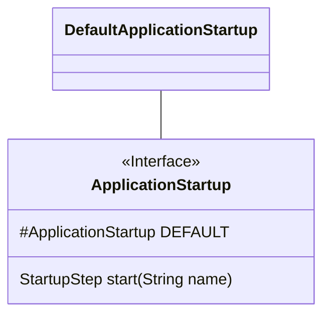
```mermaid
classDiagram

    DefaultApplicationStartup -- ApplicationStartup

    class ApplicationStartup
    <<Interface>> ApplicationStartup
    ApplicationStartup :#ApplicationStartup DEFAULT
    ApplicationStartup : StartupStep start(String name)
```

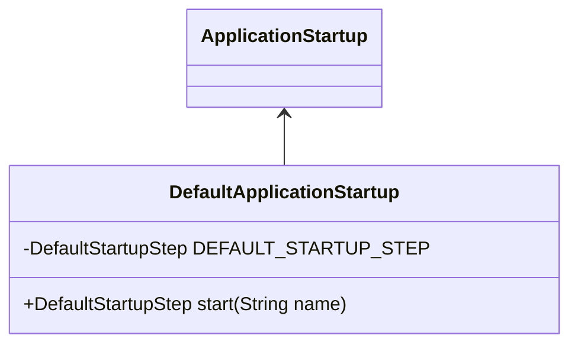
```mermaid
classDiagram
    ApplicationStartup <-- DefaultApplicationStartup
    class DefaultApplicationStartup
    DefaultApplicationStartup: -DefaultStartupStep DEFAULT_STARTUP_STEP
    DefaultApplicationStartup: +DefaultStartupStep start(String name)
```

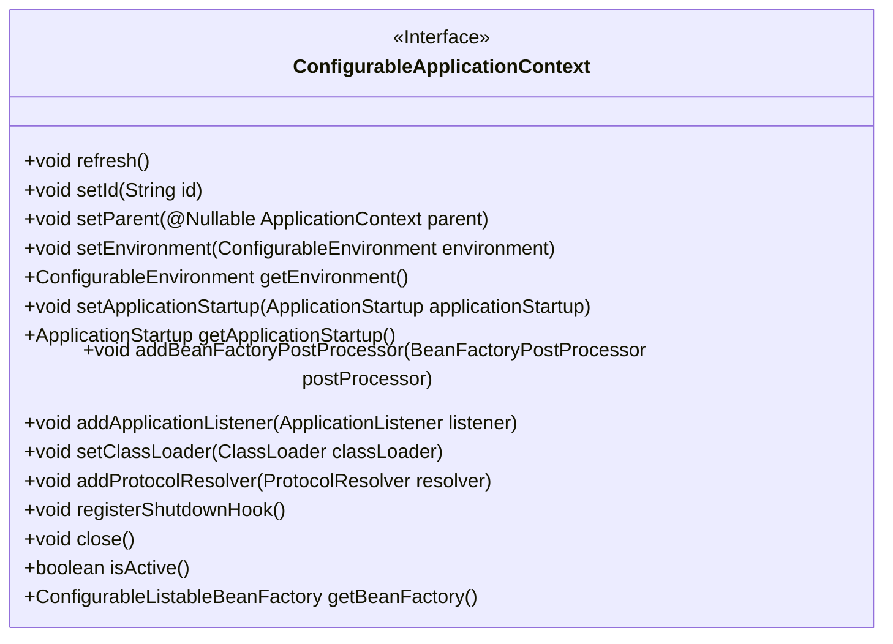
```mermaid
classDiagram

    class ConfigurableApplicationContext
    <<Interface>> ConfigurableApplicationContext
    ConfigurableApplicationContext : +void refresh()
    ConfigurableApplicationContext : +void setId(String id)
    ConfigurableApplicationContext : +void setParent(@Nullable ApplicationContext parent)
    ConfigurableApplicationContext : +void setEnvironment(ConfigurableEnvironment environment)
    ConfigurableApplicationContext : +ConfigurableEnvironment getEnvironment()
    ConfigurableApplicationContext : +void setApplicationStartup(ApplicationStartup applicationStartup)
    ConfigurableApplicationContext : +ApplicationStartup getApplicationStartup()
    ConfigurableApplicationContext : +void addBeanFactoryPostProcessor(BeanFactoryPostProcessor postProcessor)
    ConfigurableApplicationContext : +void addApplicationListener(ApplicationListener<?> listener)
    ConfigurableApplicationContext : +void setClassLoader(ClassLoader classLoader)
    ConfigurableApplicationContext : +void addProtocolResolver(ProtocolResolver resolver)
    ConfigurableApplicationContext : +void registerShutdownHook()
    ConfigurableApplicationContext : +void close()
    ConfigurableApplicationContext : +boolean isActive()
    ConfigurableApplicationContext : +ConfigurableListableBeanFactory getBeanFactory()
```

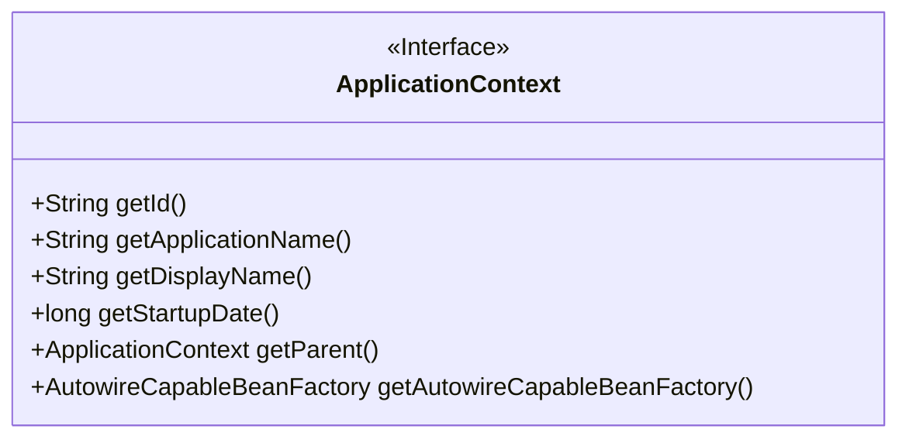
```mermaid
classDiagram

    class ApplicationContext
    <<Interface>> ApplicationContext
    ApplicationContext : +String getId()
    ApplicationContext : +String getApplicationName()
    ApplicationContext : +String getDisplayName()
    ApplicationContext : +long getStartupDate()
    ApplicationContext : +ApplicationContext getParent()
    ApplicationContext : +AutowireCapableBeanFactory getAutowireCapableBeanFactory()
```

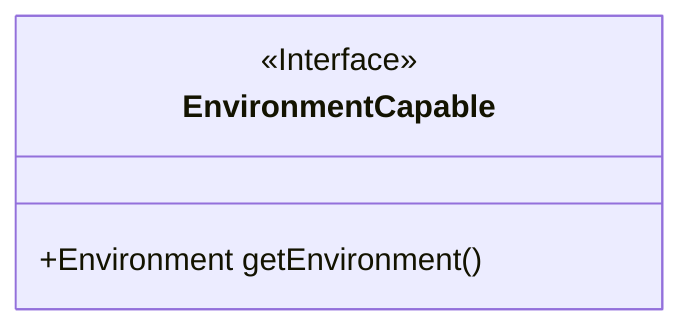
```mermaid
classDiagram

    class EnvironmentCapable
    <<Interface>> EnvironmentCapable
    EnvironmentCapable : +Environment getEnvironment()
```

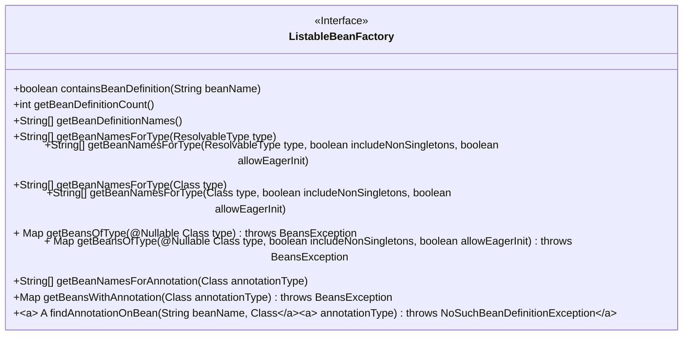
```mermaid
classDiagram

    class ListableBeanFactory
    <<Interface>> ListableBeanFactory
    ListableBeanFactory : +boolean containsBeanDefinition(String beanName)
    ListableBeanFactory : +int getBeanDefinitionCount()
    ListableBeanFactory : +String[] getBeanDefinitionNames()
    ListableBeanFactory : +String[] getBeanNamesForType(ResolvableType type)
    ListableBeanFactory : +String[] getBeanNamesForType(ResolvableType type, boolean includeNonSingletons, boolean allowEagerInit)
    ListableBeanFactory : +String[] getBeanNamesForType(Class<?> type)
    ListableBeanFactory : +String[] getBeanNamesForType(Class<?> type, boolean includeNonSingletons, boolean allowEagerInit)
    ListableBeanFactory : +<T> Map<String, T> getBeansOfType(@Nullable Class<T> type) throws BeansException
    ListableBeanFactory : +<T> Map<String, T> getBeansOfType(@Nullable Class<T> type, boolean includeNonSingletons, boolean allowEagerInit) throws BeansException
    ListableBeanFactory : +String[] getBeanNamesForAnnotation(Class<? extends Annotation> annotationType)
    ListableBeanFactory : +Map<String, Object> getBeansWithAnnotation(Class<? extends Annotation> annotationType) throws BeansException
    ListableBeanFactory : +<A extends Annotation> A findAnnotationOnBean(String beanName, Class<A> annotationType) throws NoSuchBeanDefinitionException
```

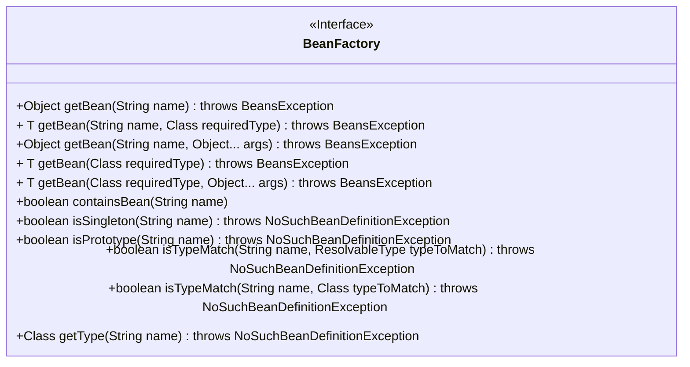
```mermaid
classDiagram

    class BeanFactory
    <<Interface>> BeanFactory
    BeanFactory : +Object getBean(String name) throws BeansException
    BeanFactory : +<T> T getBean(String name, Class<T> requiredType) throws BeansException
    BeanFactory : +Object getBean(String name, Object... args) throws BeansException
    BeanFactory : +<T> T getBean(Class<T> requiredType) throws BeansException
    BeanFactory : +<T> T getBean(Class<T> requiredType, Object... args) throws BeansException
    BeanFactory : +boolean containsBean(String name)
    BeanFactory : +boolean isSingleton(String name) throws NoSuchBeanDefinitionException
    BeanFactory : +boolean isPrototype(String name) throws NoSuchBeanDefinitionException
    BeanFactory : +boolean isTypeMatch(String name, ResolvableType typeToMatch) throws NoSuchBeanDefinitionException
    BeanFactory : +boolean isTypeMatch(String name, Class<?> typeToMatch) throws NoSuchBeanDefinitionException
    BeanFactory : +Class<?> getType(String name) throws NoSuchBeanDefinitionException
```

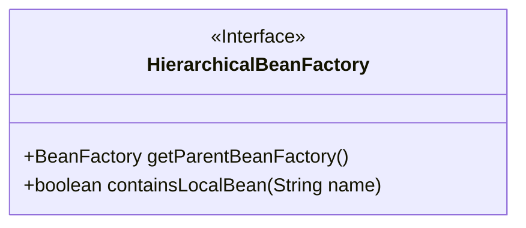
```mermaid
classDiagram

    class HierarchicalBeanFactory
    <<Interface>> HierarchicalBeanFactory
    HierarchicalBeanFactory : +BeanFactory getParentBeanFactory()
    HierarchicalBeanFactory : +boolean containsLocalBean(String name)
```

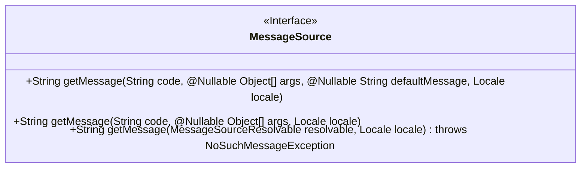
```mermaid
classDiagram

    class MessageSource
    <<Interface>> MessageSource
    MessageSource : +String getMessage(String code, @Nullable Object[] args, @Nullable String defaultMessage, Locale locale)
    MessageSource : +String getMessage(String code, @Nullable Object[] args, Locale locale)
    MessageSource : +String getMessage(MessageSourceResolvable resolvable, Locale locale) throws NoSuchMessageException
```

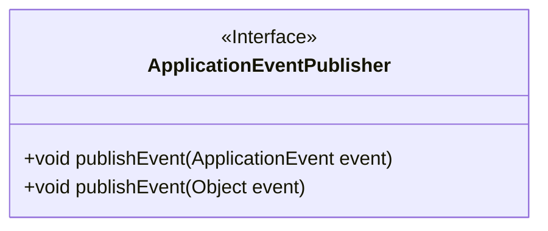
```mermaid
classDiagram

    class ApplicationEventPublisher
    <<Interface>> ApplicationEventPublisher
    ApplicationEventPublisher : +void publishEvent(ApplicationEvent event)
    ApplicationEventPublisher : +void publishEvent(Object event)
```

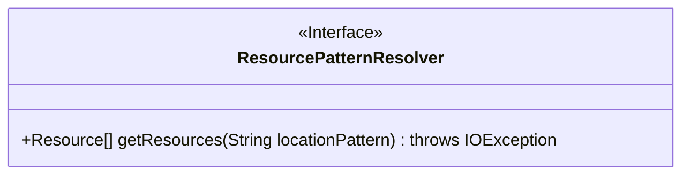
```mermaid
classDiagram

    class ResourcePatternResolver
    <<Interface>> ResourcePatternResolver
    ResourcePatternResolver : +Resource[] getResources(String locationPattern) throws IOException
```

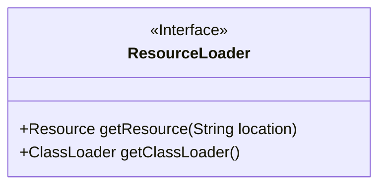
```mermaid
classDiagram

    class ResourceLoader
    <<Interface>> ResourceLoader
    ResourceLoader : +Resource getResource(String location)
    ResourceLoader : +ClassLoader getClassLoader()
```

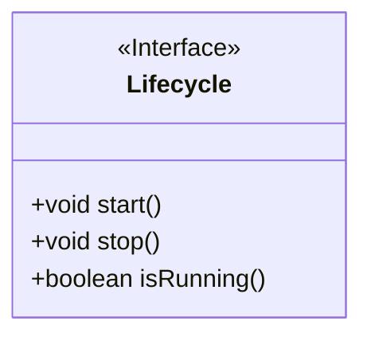
```mermaid
classDiagram

    class Lifecycle
    <<Interface>> Lifecycle
    Lifecycle : +void start()
    Lifecycle : +void stop()
    Lifecycle : +boolean isRunning()
```

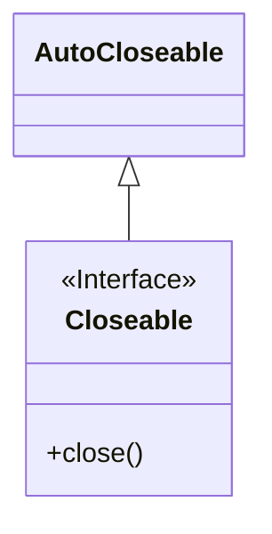
```mermaid
classDiagram

    AutoCloseable <|-- Closeable
    class Closeable
    <<Interface>> Closeable
    Closeable : +close()
```

---
---
---

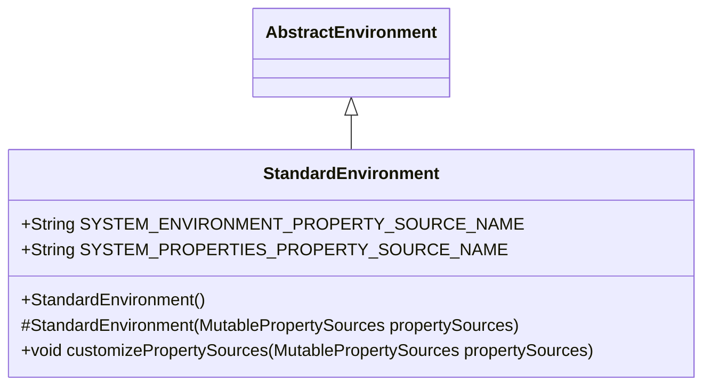
```mermaid
classDiagram

    AbstractEnvironment <|-- StandardEnvironment
    class StandardEnvironment
    StandardEnvironment : +String SYSTEM_ENVIRONMENT_PROPERTY_SOURCE_NAME
    StandardEnvironment : +String SYSTEM_PROPERTIES_PROPERTY_SOURCE_NAME
    StandardEnvironment : +StandardEnvironment()
    StandardEnvironment : #StandardEnvironment(MutablePropertySources propertySources)
    StandardEnvironment : +void customizePropertySources(MutablePropertySources propertySources)

```

---
---
---

---
---
---

---
---
---

---
---
---
