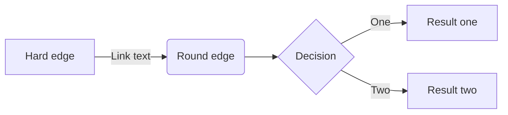
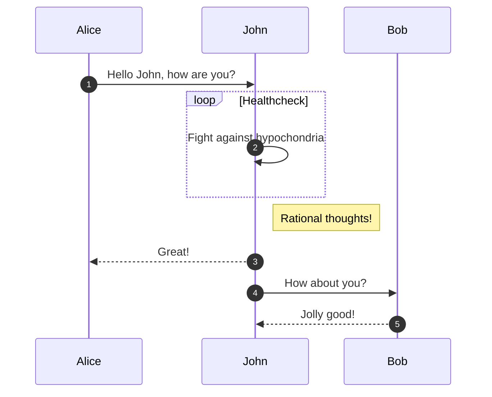
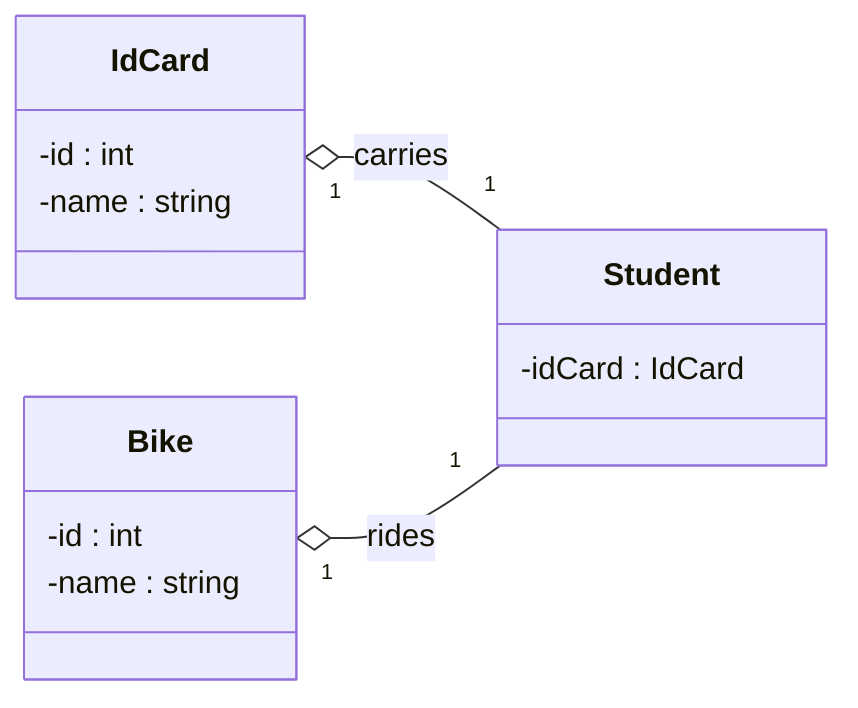
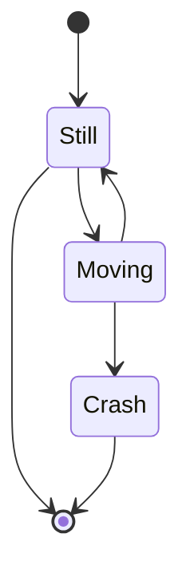
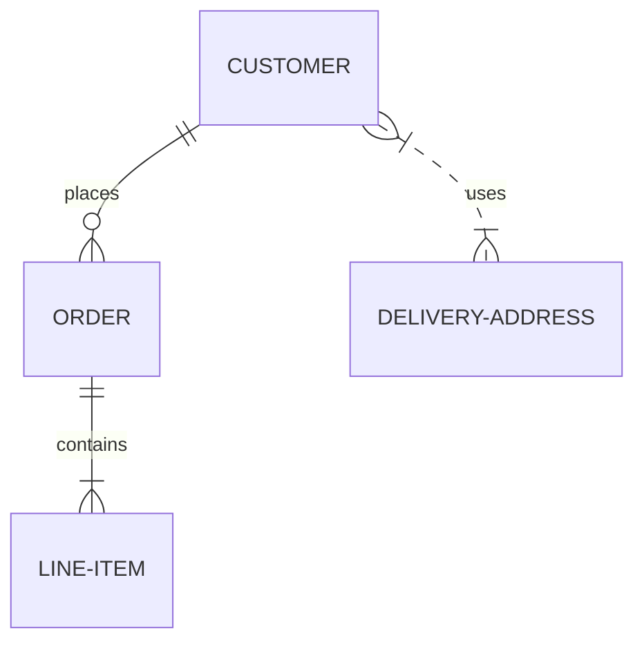
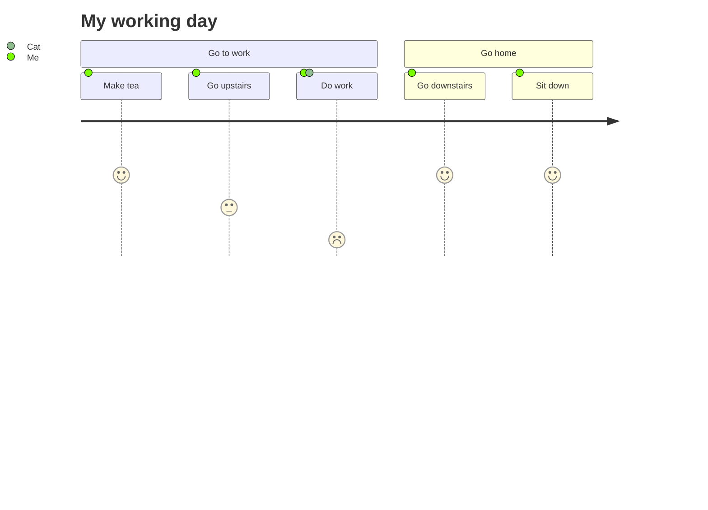
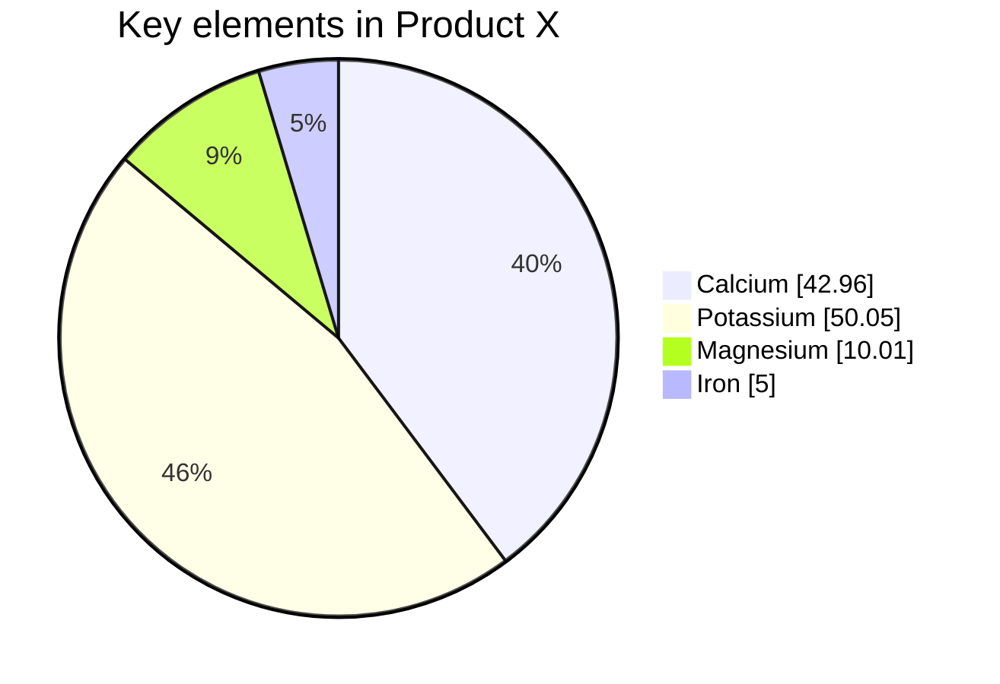
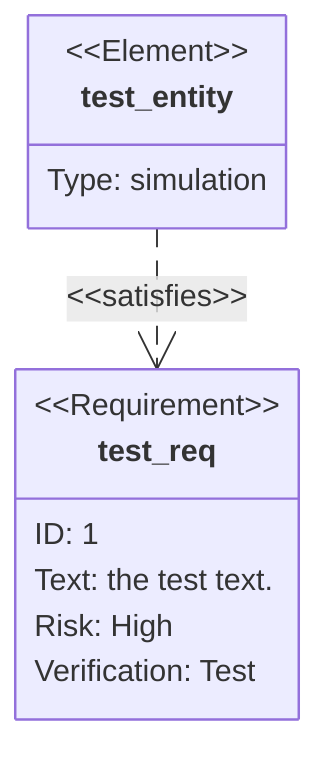
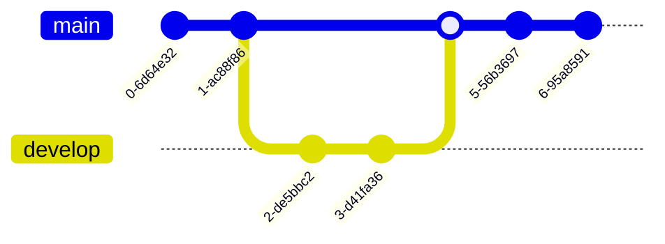

### mermaid
#### Flowcharts
#### Sequence diagram
#### Class diagrams
#### State diagrams
#### Entity Relationship Diagrams
#### User Journey Diagram
#### Gantt diagrams
#### Pie chart diagrams
#### Requirement Diagram
#### Gitgraph Diagrams

### mermaid reference
#### mermaid-js.github.io

```mermaid
gantt 
dateFormat HH:mm
axisFormat %H:%M
Initial milestone : milestone, m1, 17:49,2min
taska2 : 10min
taska3 : 5min 
Final milestone : milestone, m2, 18:14, 2min
```

